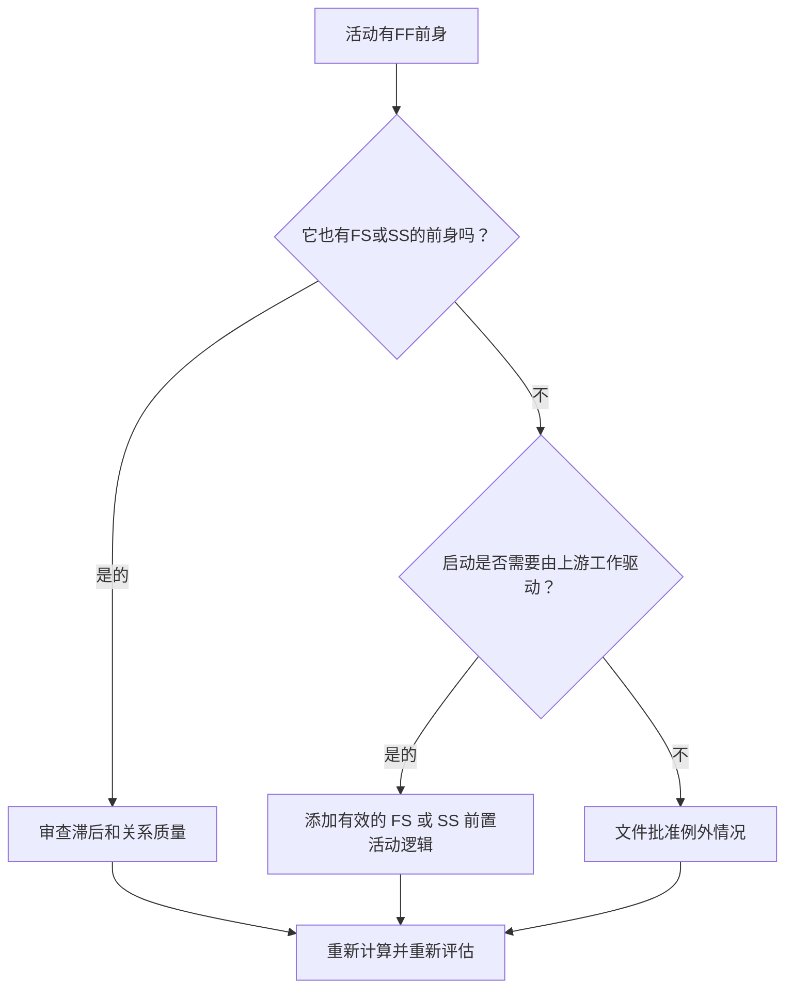

## 目的

本指南帮助进度计划员检查和纠正具有“完成到完成”前置任务但没有“完成到开始”或“开始到开始”前置任务的活动。它通过确认活动开始（不仅是结束）连接到上游进度计划网络来支持更强大的 CPM 逻辑。

## 开始之前

在采取行动之前收集以下信息：

- 该指标的当前评估结果。
- 有 FF 前身且没有 FS 或 SS 前身的活动列表。
- 每个活动的前置活动关系详细信息。
- 活动类型、持续时间、状态、日历、总浮时和 WBS。
- 影响活动或其先前活动的任何滞后、限制或预期日期。
- 相关施工、工程、采购、访问、批准或移交顺序信息。

## 了解您的结果

一个强有力的结果是在这种情况下未解决的活动为零。这意味着其完成与先前工作相关的活动在需要时也具有有效的启动驱动逻辑。

可接受的结果可能包括记录的异常，例如工作量活动、管理活动或不需要启动逻辑的有意建模的并行工作。这些应该被审查而不是假设有效。

弱结果意味着多个活动可以相对于前一个活动完成，但它们的开始不受上游工作的控制。这可能允许活动比实际序列支持更早开始。

## 改进目标

目标是 FF 前置活动的未解决活动为 0，并且没有 FS 或 SS 前置活动。

目标是确认每个活动都有一个现实的启动驱动前置活动，其中启动取决于上游工作，或者启动逻辑的缺乏是合理的并记录在案。

## 行动计划

### 第 1 步：确定主要问题

创建 P6 布局或导出，其中列出至少有一个 FF 前趋且没有 FS 或 SS 前趋的活动。包括活动 ID、活动名称、WBS、原始持续时间、剩余持续时间、总浮时、前序、逻辑关系类型、滞后、约束和活动状态。

回顾每项活动并询问：

- 在该活动开始之前必须发生什么？
- FF 前身是否仅控制最终对齐？
- 是否缺少 FS 或 SS 前身？
- FF 关系是否用于正确模拟重叠工作？
- 该活动是否是有效的例外，例如LOE 活动或支持活动？

### 第 2 步：应用建议的修复方法

添加开始驱动逻辑，其中活动开始应取决于先前的工作。当前一个活动完成之前活动无法开始时，请使用 FS。当活动可以在前一个活动开始或达到定义的进度点之后开始时，使用 SS。

检查 FF 与滞后的关系。如果使用滞后来近似启动依赖性，请用更清晰的 FS 或 SS 逻辑替换或补充它。避免仅仅为了满足指标而添加关系；每个关系都应该反映真实的工作顺序。

如果该活动是有效的异常，请在笔记本主题、UDF、注释字段或计划质量跟踪器中记录原因。

### 第 3 步：删除常见拦截器

常见的障碍包括复制旧计划中的逻辑、​​过度使用 FF 关系、不明确的访问或发布点以及缺少现场或专业领导的输入。通过与负责人一起检查实际的启动条件来解决这些问题。

另一个阻碍因素是，当两个活动必须一起完成时，FF 逻辑就足够了。完成对齐可能是有效的，但后续活动通常仍然需要明确的开始条件。

### 第 4 步：验证更改

修正后重新计算进度计划。重新运行指标并确认每个剩余活动均已更正或记录为已批准的例外情况。

审查对早期日期、总浮时、关键路径、最长路径和近期里程碑的影响。如果添加开始逻辑更改了关键日期，请将结果传达给项目控制主管或 PMO 审核员。

## 改善计划

### 第一天：回顾和诊断

运行指标，确认受影响的活动列表，并将活动分为缺少启动逻辑、弱 FF 逻辑、滞后问题和可能的异常。

### 第 2-3 天：实施优先行动

首先纠正关键和近乎关键的活动。添加有效的 FS 或 SS 前置活动，调整不适当的 FF 逻辑，并记录合理的异常。

### 第 4-5 天：监控早期结果

重新计算进度计划并审查早期日期、浮时日期、最长路径和里程碑日期的变动。

### 第六天：最终调整

与负责的专业、包所有者或施工负责人一起解决剩余的不确定问题。

### 第 7 天：重新评估和比较

再次运行评估并将结果与​​目标阈值进行比较。

## 追踪进度

使用简单的跟踪器来管理更正和批准。

| 日期 | 采取的行动 | 预期影响 | 结果/观察 | 下一步 |
| --- | --- | --- | --- | --- |
| [日期] | 审查了仅限 FF 的前置活动 | 识别缺失的启动逻辑 | [观察结果] | 分配更正 |
| [日期] | 添加了 FS 或 SS 前置活动逻辑 | 提高每千次展示费用的连续性 | [观察结果] | 重新计算进度计划 |
| [日期] | 记录有效的例外情况 | 提高审核的可追溯性 | [观察结果] | 重新评估指标 |

## 如果结果没有改善

如果结果没有改善，请检查过滤器是否识别出有效的异常、重复的逻辑或网络开发薄弱的特定 WBS 区域中的活动。重复出现的问题可能表明团队在计划过程中过于依赖 FF 关系。

当未解决的项目影响关键、近乎关键、合同、访问相关或移交相关工作时，将其上报给计划主管或 PMO 审核员。

## 维护

在每次计划更新期间和基线批准之前查看此指标。在重新排序、恢复计划、复制计划制定或重大范围变更后要特别注意。

## 摘要清单

- [ ] 当前结果已审核
- [ ] 目标阈值已确定
- [ ] 已确定的主要问题
- [ ] FF前辈回顾
- [ ] 已更正缺失的 FS 或 SS 逻辑
- [ ] 检查滞后和约束
- [ ] 记录有效的异常情况
- [ ] 进度计划重新计算
- [ ] 监测结果
- [ ] 重复评估
- [ ] 记录后续步骤
## 相关内容
- [博客模板](03_blog_template.md)
- [什么是进度计划](../../03b_blogs_zh/01_WHAT%20A%20SCHEDULE%20IS/01_blog.md)
- [强大的逻辑](../../03b_blogs_zh/02_ROBUST%20LOGIC/02_ROBUST%20LOGIC.md)
