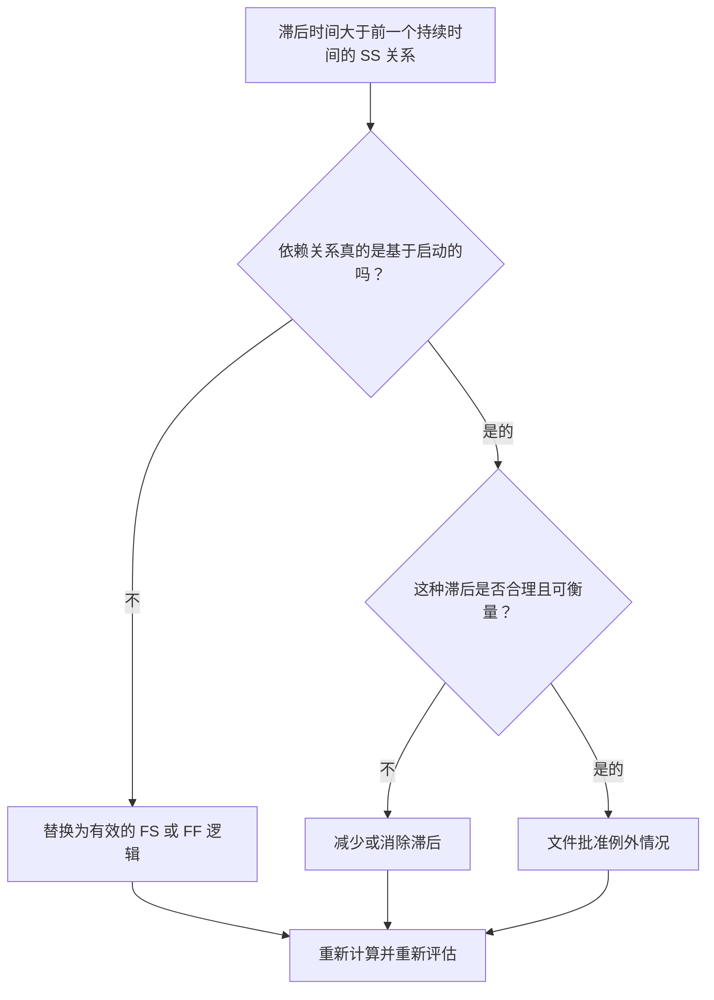

## 目的

本指南可帮助进度计划人员检查并纠正延迟大于前一活动持续时间的开始到开始关系。它通过用更好地代表真实工作序列的关系逻辑替换过多的 SS 滞后来支持更清晰的 CPM 逻辑。

## 开始之前

在采取行动之前收集以下信息：

- 该指标的当前评估结果。
- 滞后时间大于前一个持续时间的 SS 关系列表。
- 前置和后续活动 ID、名称、WBS、持续时间、日历和状态。
- 关系滞后、逻辑关系类型以及任何相关约束。
- 用于滞后的计划计算设置和日历基础。
- 解释预期依赖性的现场、工程、采购或移交逻辑。

## 了解您的结果

一个强有力的结果是零未解决的 SS 关系，其中滞后超过前一个持续时间。

可接受的结果可能包括记录的异常，但这种情况应该很少见。较长的 SS 滞后通常表明逻辑关系类型与正在建模的依赖关系不匹配。

弱结果意味着计划包含多个开始到开始链接，其中后续活动仅在比前置活动持续时间更长的延迟后才开始。这可能隐藏 SS 关系背后的完成驱动逻辑。

## 改进目标

目标是 0 个未解决的 SS 关系，其滞后时间大于前一个持续时间。

目标是确认每个关系是否应保持 SS、转换为 FS 或 FF 逻辑、减少滞后或记录为有效异常。

## 行动计划

### 第 1 步：确定主要问题

创建 P6 布局或导出，其中列出滞后大于前趋持续时间的 SS 关系。包括前置活动和后续活动 ID、活动名称、WBS、原始持续时间、剩余持续时间、逻辑关系类型、滞后、日历、总浮时和活动状态。

检查每个关系并询问：

- 为什么后续活动在这么长时间的延迟后才开始？
- 后续活动究竟是依赖于前置活动的开始，还是依赖于前置活动的完成？
- 滞后是否大于前一个原始持续时间、剩余持续时间或两者？
- 滞后是否被用于建模采购、固化、审查时间、访问或另一个真实的等待期？
- FS 或 FF 关系会使依赖性更清晰吗？

### 第 2 步：应用建议的修复方法

如果后续关系应在前继关系完成后开始，请将 SS 关系替换为 FS 关系。如果工作可以重叠，但后续活动必须先完成后续活动才能完成，则使用 FF 逻辑。

如果关系确实是基于开始的，请检查滞后值。减少用作粗略占位符或从复制逻辑继承的过度滞后。如果滞后代表真实的等待期，请确认单位、日历和说明是否正确。

避免使用长滞后来替代应在进度计划中可见的活动。如果滞后代表审查、固化、交付、动员或批准时间，请考虑将建模作为单独的活动进行。

### 第 3 步：删除常见拦截器

常见的阻碍因素包括复制之前进度计划的逻辑、隐藏的等待期、日历混乱以及保持网络简单的压力。通过与责任所有者确认预期的依赖性来解决这些问题。

另一个阻碍因素是将延迟视为无害。长滞后可能难以审查，可能隐藏风险，并且可能使延迟分析变得更加困难，因为等待期作为活动不可见。

### 第 4 步：验证更改

修正后重新计算进度计划。重新运行指标并确认每个剩余项目均已更正或记录为已批准的例外。

查看总浮时、最长路径、关键路径和近期里程碑。如果关系变化移动了关键日期，请将结果传达给项目控制负责人或 PMO 审核员。

## 改善计划

### 第一天：回顾和诊断

运行指标，确认受影响的关系列表，并将项目分为错误的逻辑关系类型、过度滞后、隐藏的活动、日历问题和可能的异常。

### 第 2-3 天：实施优先行动

首先纠正关键和近乎关键的关系。在适当的情况下将 SS 逻辑转换为 FS 或 FF，减少不合理的滞后，并记录有效的异常。

### 第 4-5 天：监控早期结果

重新计算进度计划并审查浮时、最长路径和里程碑日期的移动。

### 第六天：最终调整

与负责的专业、包所有者或施工负责人一起解决剩余的不确定问题。

### 第 7 天：重新评估和比较

再次运行评估并将结果与​​目标阈值进行比较。

## 追踪进度

使用简单的跟踪器来管理更正和批准。

| 日期 | 采取的行动 | 预期影响 | 结果/观察 | 下一步 |
| --- | --- | --- | --- | --- |
| [日期] | 审核后的 SS 滞后时间大于前一个持续时间 | 识别薄弱或不清晰的逻辑 | [观察结果] | 分配更正 |
| [日期] | 转换为 FS 或 FF 的关系 | 提高 CPM 逻辑清晰度 | [观察结果] | 重新计算进度计划 |
| [日期] | 减少或记录滞后 | 提高审核的可追溯性 | [观察结果] | 重新评估指标 |

## 如果结果没有改善

如果结果没有改善，请检查特定 WBS 区域、专业或复制的计划部分中是否重复相同的关系模式。重复的发现可能表明团队正在使用 SS 滞后作为标准快捷方式，而不是对真实的依赖关系进行建模。

当未解决的项目影响关键、近乎关键、合同、采购、审批或移交相关工作时，将其升级。

## 维护

在每次计划更新期间和基线批准之前查看此指标。在复制计划制定、重新排序、恢复计划或重大范围变更后要特别注意。

## 摘要清单

- [ ] 当前结果已审核
- [ ] 目标阈值已确定
- [ ] 已确定的主要问题
- [ ] 党卫军关系审查
- [ ] 过度滞后已得到纠正或合理化
- [ ] 在需要时应用 FS 或 FF 替代品
- [ ] 在适当的情况下对隐藏工作进行建模
- [ ] 进度计划重新计算
- [ ] 监测结果
- [ ] 重复评估
- [ ] 记录后续步骤
## 相关内容
- [博客模板](03_blog_template.md)
- [什么是进度计划](../../03b_blogs_zh/01_WHAT%20A%20SCHEDULE%20IS/01_blog.md)
- [强大的逻辑](../../03b_blogs_zh/02_ROBUST%20LOGIC/02_ROBUST%20LOGIC.md)
