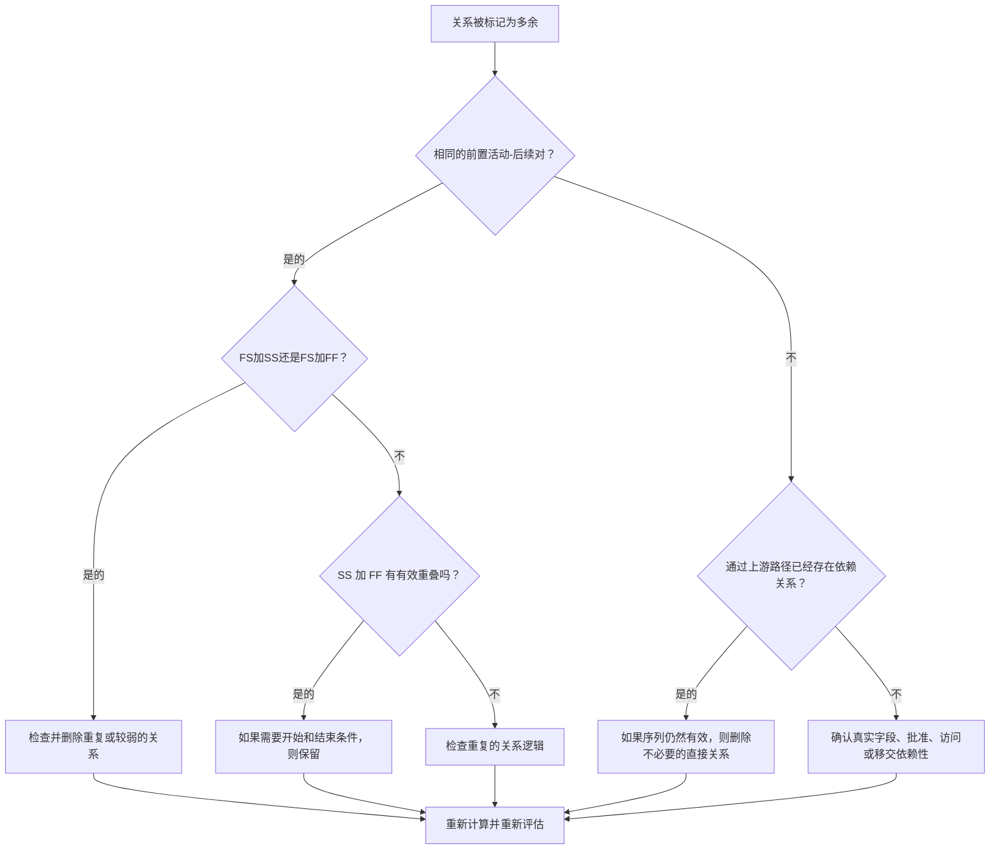

## 目的

本指南帮助进度计划人员识别并删除 Primavera P6 进度计划中的冗余逻辑。它适用于重复的关系模式、重复的前置活动逻辑以及不代表真实工作序列的不必要的依赖关系。

## 开始之前

在采取行动之前收集以下信息：

- 该指标的当前评估结果。
- 标记为冗余逻辑的活动和关系列表。
- 每个标记的活动的前置活动和后续详细信息。
- 逻辑关系类型、滞后、日历、总浮时和驱动关系指标。
- WBS、活动代码以及专业或工作包所有权。
- 解释真正依赖性的现场、工程、采购、批准或移交信息。

## 了解您的结果

一个强有力的结果是未解决的冗余关系为零。

可接受的结果可能包括罕见的记录异常，其中出于正当理由故意使用看起来重复的逻辑。应仔细审查这些情况，因为冗余逻辑通常是进度质量问题。

弱结果意味着计划包含重复或不必要的关系逻辑。当复制的计划部分未清理、添加关系而不检查现有路径或在相同活动之间使用多个依赖逻辑关系类型时，可能会发生这种情况。

## 改进目标

目标是 0 个未解决的冗余关系。

目标是仅保留代表真实依赖关系的关系，并删除重复、掩盖或夸大实际工作序列的逻辑。

## 行动计划

### 第 1 步：确定主要问题

创建 P6 布局、报告或外部关系审查，以识别可能的冗余逻辑。重点关注这些案例：

- 同一前置活动多次连接到同一后任，尤其是 FS 加 SS 或 FS 加 FF。
- 当正确建模重叠并且开始和结束条件都很重要时，相同两个活动之间的 SS 加 FF 可能有效。
- 具有与其前置活动相同的前置活动和逻辑关系类型的活动，通过链创建重复的继承逻辑。
- 较长的重复前趋链，其中相同的依赖关系出现多个步骤。
- 不改变顺序、日期、浮时、移交、访问或风险控制的依赖关系。

查看每个标记的关系并询问：

- 这种关系是否增加了真正的依赖性？
- 依赖性是否已由相同活动之间的另一种关系表示？
- 依赖关系是否已由上游路径表示？
- 删除关系会改变有效的计划逻辑还是只会简化网络？
- 驱动日期的关系是否有合理的理由，还是只是因为添加了冗余逻辑？

### 第 2 步：应用建议的修复方法

从精确的重复项和重复的前置活动-后续对开始。如果相同的两个活动以 FS 加 SS 或 FS 加 FF 连接，请确定哪个关系代表真正的依赖关系。删除重复或削弱逻辑的关系。

分别查看 SS 和 FF 对。当一个关系控制重叠工作何时开始而另一个关系控制重叠工作何时完成时，这种组合可能有效。仅当这两个条件都真实存在并由工作顺序记录时才保留它。

接下来，回顾继承的前置活动逻辑。如果活动 C 与活动 B 具有相同的前置活动关系，并且活动 B 已经是活动 C 的前置活动，则来自较早活动的直接关系可能是不必要的。如果 CPM 序列通过现有路径保持正确，请将其删除。

最后，删除不支持工作顺序、访问、批准、移交、风险控制或合同逻辑的不必要的依赖项。

### 第 3 步：删除常见拦截器

常见的阻碍因素包括从旧计划中复制逻辑、过度建模以使网络看起来已连接，以及在更新期间添加关系而不检查现有路径。

另一个障碍是担心消除关系会削弱进度计划编制。目标不是取消有效的控制；而是取消有效的控制。它是为了删除网络中已经存在的重复控制的关系。

### 第 4 步：验证更改

删除或调整冗余逻辑后重新计算进度计划。查看总浮时、驱动关系、最长路径、关键路径和关键里程碑日期。

如果删除关系意外更改日期，请调查删除的链接是否实际上提供了有效的依赖项，或者是否需要更准确地添加另一个缺失的关系。

## 改善计划

### 第一天：回顾和诊断

运行指标，确认受影响的关系列表，并将结果分成重复对、FS 加 SS/FF 组合、继承的前趋逻辑和不必要的依赖关系。

### 第 2-3 天：实施优先行动

首先纠正关键和近乎关键的关系。删除精确的重复项，清理重复的前置活动对，并记录有效的 SS 加 FF 组合。

### 第 4-5 天：监控早期结果

重新计算进度计划并审查浮时、最长路径、驱动关系和里程碑日期的移动。

### 第六天：最终调整

与负责的专业、包所有者或施工负责人一起解决不确定的问题。

### 第 7 天：重新评估和比较

再次运行评估并将结果与​​目标阈值进行比较。

## 追踪进度

使用简单的跟踪器来管理更正和批准。

| 日期 | 采取的行动 | 预期影响 | 结果/观察 | 下一步 |
| --- | --- | --- | --- | --- |
| [日期] | 审查冗余关系列表 | 识别重复或不必要的逻辑 | [观察结果] | 分配更正 |
| [日期] | 删除了重复的关系 | 简化 CPM 网络 | [观察结果] | 重新计算进度计划 |
| [日期] | 记录有效的例外情况 | 提高审核的可追溯性 | [观察结果] | 重新评估指标 |

## 如果结果没有改善

如果结果没有改善，请检查冗余逻辑是否集中在特定的 WBS 区域、复制的项目部分、规程或计划更新周期中。重复的发现可能表明关系清理不是正常进度计划工作流程的一部分。

当未解决的冗余逻辑影响关键、近关键、合同、访问、批准或移交相关工作时，将其升级。

## 维护

在每次计划更新期间和基线批准之前查看此指标。在复制计划开发、重新排序、恢复计划或大型逻辑修改后要特别注意。

## 摘要清单

- [ ] 当前结果已审核
- [ ] 目标阈值已确定
- [ ] 已确定的主要问题
- [ ] 已审查重复的前置活动-后续对
- [ ] FS 加 SS 或 FS 加 FF 组合已修正
- [ ] 记录有效的 SS 加 FF 组合
- [ ] 继承前置活动逻辑回顾
- [ ] 删除不必要的依赖项
- [ ] 进度计划重新计算
- [ ] 监测结果
- [ ] 重复评估
- [ ] 记录后续步骤
## 相关内容
- [博客模板](03_blog_template.md)
- [什么是进度计划](../../03b_blogs_zh/01_WHAT%20A%20SCHEDULE%20IS/01_blog.md)
- [强大的逻辑](../../03b_blogs_zh/02_ROBUST%20LOGIC/02_ROBUST%20LOGIC.md)
