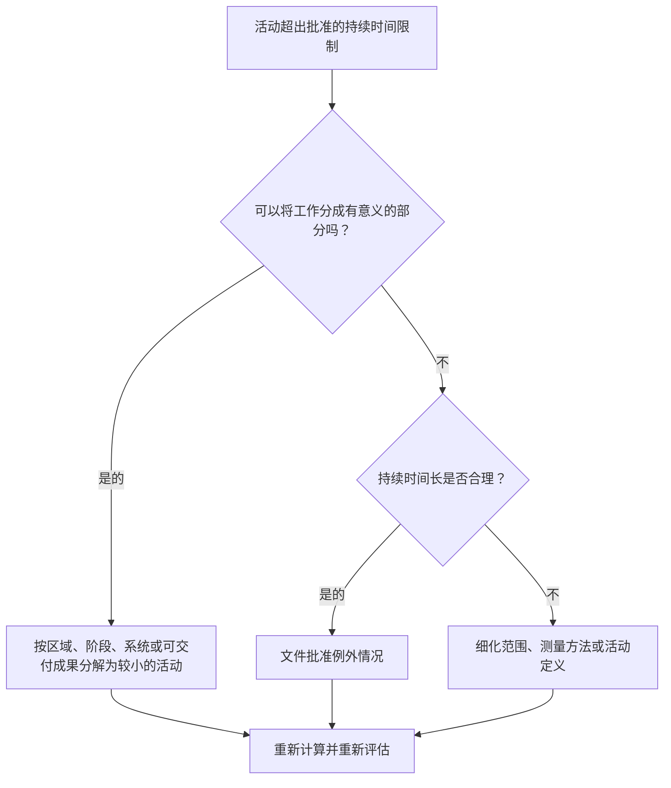

## 目的

本指南帮助进度计划人员审查和改进持续时间长于批准的项目阈值的活动。可接受的持续时间取决于项目类型、详细程度、报告周期、合同要求以及客户对长期活动的敏感度。

## 开始之前

在采取行动之前收集以下信息：

- 该指标的当前评估结果。
- 批准的项目或进度级别的最大活动持续时间。
- 超过持续时间阈值的活动列表。
- 原始工期、剩余工期、活动类型、状态、WBS、日历和总浮时。
- 基线要求、客户报告期望和 PMO 进度质量规则。
- 前瞻计划周期、进度更新周期以及专业或包所有权。
- 任何合理的例外情况，例如采购、固化、交付、审查、测试或LOE 活动活动。

## 了解您的结果

一个强有力的结果是超过批准的长期阈值的未解决活动为零。

可接受的结果可能包括记录的异常，特别是对于无法合理分解或有意作为摘要式控制活动进行管理的活动。这些应该是有限的并且有明确的理由。

结果不佳意味着进度计划包含许多活动，这些活动范围太广，无法有效计划和控制。这可能会降低进度可见性，并使人们更难理解哪些工作实际上推动了进度。

## 改进目标

目标是超过批准的持续时间限制的 0 项未解决的活动。

目标是将长时间的活动拆分为需要更好控制的较小的、有意义的活动，同时记录适合较长持续时间的有效异常。

## 行动计划

### 第 1 步：确定主要问题

创建 P6 布局或报告，列出超过项目定义的持续时间阈值的活动。包括活动 ID、活动名称、WBS、活动类型、原始持续时间、剩余持续时间、开始、完成、日历、总浮时和活动状态。

回顾每项活动并询问：

- 活动持续时间是否长于该项目类型和进度水平的批准阈值？
- 活动是否涵盖多个工作步骤、地点、系统、区域或可交付成果？
- 能否在每个更新周期客观地衡量进度？
- 由于客户或 PMO 对长持续时间敏感，活动是否需要更多细节？
- 该活动是否属于应长期保留的有效例外？

### 第 2 步：应用建议的修复方法

拆分较长的活动，可以将工作分成较小的部分来计划和衡量。常见的分解方法包括位置、WBS 区域、专业、系统、可交付成果、阶段、人员顺序或报告周期。

拆分活动时，保留真实的逻辑顺序。添加适当的前置任务和后续任务，分配正确的日历，并确认新活动反映了工作的实际执行方式。

不要仅仅为了满足指标而拆分活动。细分应该改善控制、进度衡量、前瞻性计划或报告清晰度。

### 第 3 步：删除常见拦截器

常见的阻碍因素包括范围定义不完整、WBS 结构薄弱、现场输入有限以及保持较低活动数量的压力。通过与负责的专业、包所有者或施工负责人一起审查长期活动来解决这些问题。

另一个阻碍因素是使用一项较长的活动来表示应按顺序计划的工作。如果活动包含多个移交、工作面、可交付成果或控制点，则可能需要更多细节。

### 第 4 步：验证更改

分割或调整长时间活动后重新计算进度计划编制。确认每个新活动都有适当的逻辑、持续时间、日历和进度衡量。

查看总浮时、关键路径、最长路径和里程碑日期。如果细分更改了关键日期，请将原因传达给项目控制负责人或 PMO 审核员。

## 改善计划

### 第一天：回顾和诊断

运行指标，确认持续时间阈值，并将活动分为拆分候选、有效例外和需要所有者输入的项目。

### 第 2-3 天：实施优先行动

首先纠正关键、近乎关键和客户敏感的活动。分解广泛的活动并记录有效的例外情况。

### 第 4-5 天：监控早期结果

重新计算进度计划并审查浮时、最长路径、里程碑日期和前瞻可见性的移动。

### 第六天：最终调整

与负责的专业、包所有者或项目控制负责人一起解决剩余的不确定事项。

### 第 7 天：重新评估和比较

再次运行评估并将结果与​​目标阈值进行比较。

## 追踪进度

使用简单的跟踪器来管理更正和批准。

| 日期 | 采取的行动 | 预期影响 | 结果/观察 | 下一步 |
| --- | --- | --- | --- | --- |
| [日期] | 审查长期活动 | 确定需要分解的活动 | [观察结果] | 指定所有者 |
| [日期] | 将活动分解为更小的工作步骤 | 提高进度可见性 | [观察结果] | 重新计算进度计划 |
| [日期] | 记录有效的异常 | 提高审核的可追溯性 | [观察结果] | 重新评估指标 |

## 如果结果没有改善

如果结果没有改善，请检查持续时间阈值是否不清楚、应用不一致或与进度水平不一致。还要检查长期活动是否集中在特定的 WBS 领域、专业或项目阶段。

当未解决的长期活动影响关键、近乎关键、合同、报告或客户敏感工作时，将其升级。

## 维护

在每次计划更新、基线开发和主要重新排序练习期间审查此指标。如果项目进入不同的阶段或详细程度，请更新阈值。

## 摘要清单

- [ ] 当前结果已审核
- [ ] 目标阈值已确定
- [ ] 已确定的主要问题
- [ ] 回顾了长时间的活动
- [ ] 已确定分裂候选人
- [ ] 有用的活动被分解
- [ ] 记录有效的异常情况
- [ ] 进度计划重新计算
- [ ] 监测结果
- [ ] 重复评估
- [ ] 记录后续步骤
## 相关内容
- [博客模板](03_blog_template.md)
- [什么是进度计划](../../03b_blogs_zh/01_WHAT%20A%20SCHEDULE%20IS/01_blog.md)
- [强大的逻辑](../../03b_blogs_zh/02_ROBUST%20LOGIC/02_ROBUST%20LOGIC.md)
