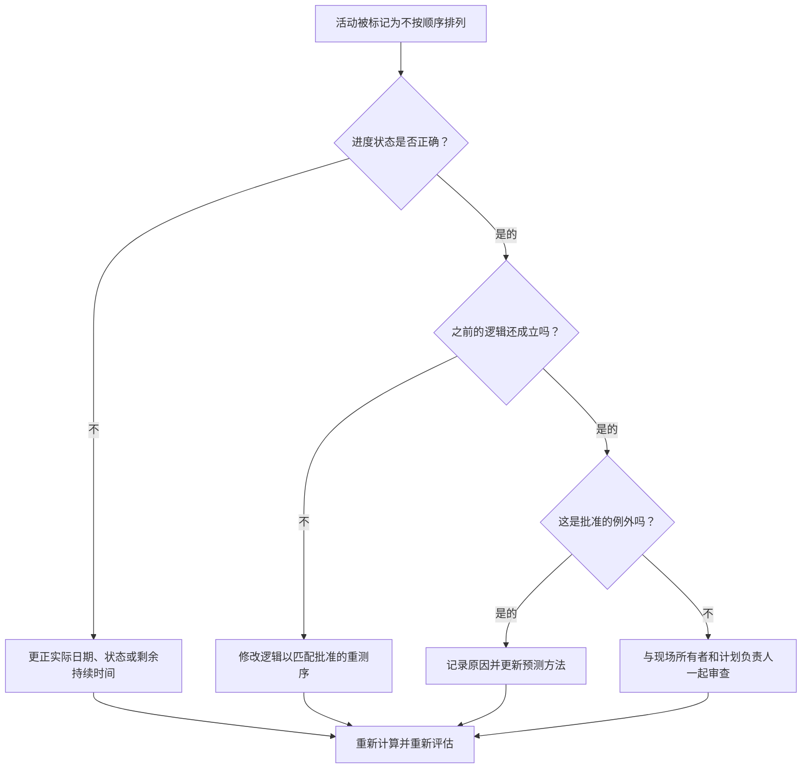

## 目的

本指南帮助进度计划员检查并纠正 Primavera P6 中不按顺序排列的活动。当活动在其所需的前置逻辑得到满足之前已经开始或进展时，它适用。

## 开始之前

在采取行动之前收集以下信息：

- 该指标的当前评估结果。
- 标记为无序的活动列表。
- 数据 最近更新中使用的日期。
- 实际开始、实际完成、剩余持续时间和活动状态。
- 前置活动和后续关系详细信息，包括逻辑关系类型和滞后。
- 计划计算设置，特别是保留逻辑和进度覆盖。
- 现场解释为什么工作在计划逻辑完成之前就取得了进展。

## 了解您的结果

一个强有力的结果是未解决的无序活动为零。

可接受的结果可能包括记录的异常情况，其中工作有意重新排序，并且进度逻辑已更新以反映新计划。

弱结果意味着计划更新包含与现有逻辑网络冲突的进度。这可能表明状态不正确、缺少实际值、过时的逻辑或尚未反映在预测中的实际现场重新排序。

## 改进目标

目标是 0 个未解决的无序活动。

目标是确定每个项目是否是状态错误、逻辑错误或真正的重新排序事件，然后更正计划，使其代表当前计划。

## 行动计划

### 第 1 步：确定主要问题

创建列出无序活动的 P6 布局或报告。包括活动 ID、活动名称、WBS、状态、实际开始、实际完成、剩余工期、开始、完成、总浮时、前置任务、后续任务、逻辑关系类型、滞后和驱动关系指标。

回顾每项活动并询问：

- 该活动是否在满足其前置要求之前实际开始？
- 前置活动状态是否正确？
- 后续活动身份是否正确？
- 字段重新排序后关系仍然有效吗？
- 是应该改变进度计划逻辑，还是应该修正进度更新？
- 正在使用哪个 P6 进度计算选项：保留逻辑还是进度覆盖？

### 第 2 步：应用建议的修复方法

首先纠正状态错误。如果实际开始、实际完成、剩余持续时间或前置状态错误，请在更改逻辑之前更新活动数据。

如果字段顺序已更改，请修改逻辑以表示已批准的当前计划。不要简单地删除前置活动关系来清除指标。用与真实执行顺序匹配的关系替换过时的逻辑。

检查保留的逻辑和进度覆盖设置。保留的逻辑通常保留剩余工作的原始前趋逻辑，而进度覆盖可以允许剩余工作继续，尽管前趋逻辑不完整。该设置应与项目控制程序保持一致，并在报告结果之前被理解。

### 第 3 步：删除常见拦截器

常见的障碍包括现场更新较晚、实际日期不完整、在没有逻辑审查的情况下接受进度的压力以及对进度计算选项的混乱。

另一个阻碍因素是将无序的进度仅视为软件问题。真正的问题是该项目是否改变了工作顺序以及现在的进度计划是否反映了批准的顺序。

### 第 4 步：验证更改

修正后重新计算进度计划。重新运行无序检查并确认每个剩余项目均已更正、合理或分配用于后续操作。

查看总浮时、最长路径、关键路径和近期里程碑。无序更正可能会改变预测日期，因此请向项目控制负责人或 PMO 审核员传达有意义的影响。

## 改善计划

### 第一天：回顾和诊断

运行指标，确认数据日期，并将结果分为状态错误、逻辑错误、实际重新排序和可能的异常。

### 第 2-3 天：实施优先行动

首先纠正关键、近乎关键和前瞻活动。更新状态、修改过时的逻辑并记录批准的重新排序。

### 第 4-5 天：监控早期结果

重新计算计划并审查浮时、最长路径、关键路径和里程碑日期的变化。

### 第六天：最终调整

与现场领导、专业负责人或计划经理一起解决剩余问题。

### 第 7 天：重新评估和比较

再次运行评估并将结果与​​目标阈值进行比较。

## 追踪进度

使用简单的跟踪器来管理更正和批准。

| 日期 | 采取的行动 | 预期影响 | 结果/观察 | 下一步 |
| --- | --- | --- | --- | --- |
| [日期] | 审查了无序的活动 | 识别状态或逻辑问题 | [观察结果] | 指定所有者 |
| [日期] | 更正状态或实际日期 | 提高更新准确性 | [观察结果] | 重新计算进度计划 |
| [日期] | 修订批准重测序的逻辑 | 提高预测可靠性 | [观察结果] | 重新评估指标 |

## 如果结果没有改善

如果结果没有改善，请检查相同的工作区域是否反复无序地进行。这可能表明更新专业薄弱、逻辑不切实际、现场协调不完整或频繁未经批准的重新排序。

当未解决的项目影响关键、近乎关键、合同、访问、移交或客户敏感工作时，将其升级。

## 维护

在发布计划之前，请在每个更新周期中查看此指标。在将进度报告用于 PMO 报告、延迟分析或恢复计划之前，请确认无序进度已得到解决。

## 摘要清单

- [ ] 当前结果已审核
- [ ] 目标阈值已确定
- [ ] 数据日期确认
- [ ] 已确定的主要问题
- [ ] 已更正状态错误
- [ ] 逻辑错误已更正
- [ ] 批准的重测序记录
- [ ] 已审核计划计算设置
- [ ] 进度计划重新计算
- [ ] 监测结果
- [ ] 重复评估
- [ ] 记录后续步骤
## 相关内容
- [博客模板](03_blog_template.md)
- [什么是进度计划](../../03b_blogs_zh/01_WHAT%20A%20SCHEDULE%20IS/01_blog.md)
- [强大的逻辑](../../03b_blogs_zh/02_ROBUST%20LOGIC/02_ROBUST%20LOGIC.md)
