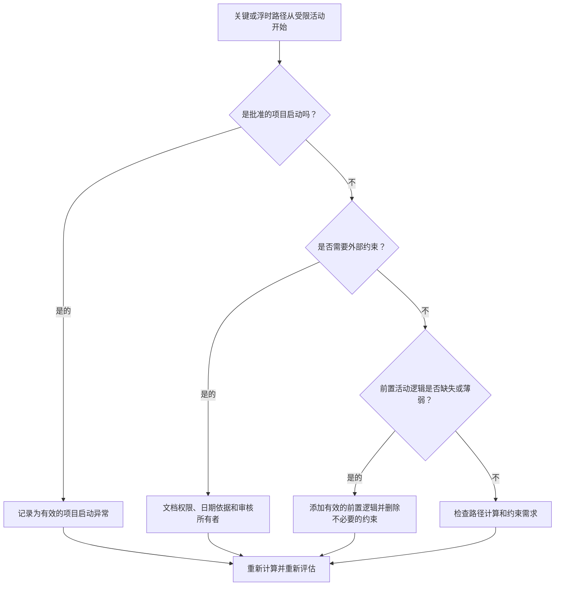

# 以约束开始的关键路径或浮时路径 - 改进指南

## 目的

本指南帮助进度计划人员检查以受限活动开始的关键路径或浮时路径链。批准的项目启动通常是一个有效的例外；需要关注的是下游路径何时从约束而不是逻辑序列开始。

## 开始之前

在采取行动之前收集以下信息：

- 该指标的当前评估结果。
- Primavera P6 的关键路径或浮时路径报告。
- 每个标记路径上的第一个活动。
- 约束类型、约束日期和任何预期日期。
- 路径起始活动的前置活动和后续关系。
- 数据日期、项目开始里程碑、基线要求以及 PMO 或客户进度计划规则。
- 对任何批准的外部约束的解释。

## 了解您的结果

一个强有力的结果是，除了已批准的项目启动之外，从约束开始的未解决的关键或浮时路径为零。

可接受的结果可能包括记录的外部约束，例如开工通知、所有者访问释放、许可证释放或合同保留点。这些应该是有明确理由的。

弱结果意味着路径可能由强加的日期而不是网络逻辑控制。这可能会降低关键路径或浮时路径对于预测、报告和延迟分析的可靠性。

## 改进目标

目标是 0 个以约束开始的未解析路径。

目标是确认路径是否应从批准的项目开始、从有效的前置活动逻辑或从记录的外部约束开始。

## 行动计划

### 第 1 步：确定主要问题

创建显示关键路径和选定浮时路径的 P6 布局或报告。对于每条路径上的第一个活动，包括活动 ID、活动名称、WBS、开始、完成、总浮时、自由浮时、主要约束、约束日期、前置任务、后续任务和活动状态。

检查每个标记的路径并询问：

- 这是批准的项目启动还是通知进行的活动？
- 约束是合同规定的还是外部规定的？
- 该活动是否缺少前置逻辑？
- 约束是否掩盖了薄弱或不完整的进度计划网络？
- 如果移除约束，路径的起点会有所不同吗？
- 是否记录了受限启动以供 PMO 或客户审核？

### 第 2 步：应用建议的修复方法

如果受限活动是已批准的项目起点，请将其记录为有效的例外，并确认它是路径的预期起点。

如果外部需要约束，只有在原因明确的情况下才保留它。记录来源，例如合同里程碑、访问发布、许可证、所有者指示或监管要求。

如果不需要约束，请将其删除并添加有效的前置逻辑，其中活动依赖于早期工作、批准、移交、采购或访问。重新计算计划并确认路径现在是逻辑驱动的。

### 第 3 步：删除常见拦截器

常见的障碍包括从旧基线继承的约束、用于强制日期的约束、缺少接口逻辑以及外部日期的所有权不明确。

另一个阻碍因素是仅仅因为 P6 识别出一条关键路径就认为它是可靠的。如果路径以不必要的约束开始，则该路径可能反映的是日期控制而不是真正的 CPM 逻辑。

### 第 4 步：验证更改

更改约束或逻辑后重新计算计划。查看关键路径、最长路径、选定的浮时路径、总浮时和关键里程碑日期。

如果路径发生显着变化，请记录原因并将影响传达给项目控制主管、PMO 审核员或客户进度计划员。

## 改善计划

### 第一天：回顾和诊断

运行指标，识别受约束的路径启动活动，并将结果分为项目启动异常、有效的外部约束、缺失的逻辑和不必要的约束。

### 第 2-3 天：实施优先行动

首先纠正关键路径和客户端敏感路径。删除不必要的约束，添加缺失的逻辑，并记录批准的例外情况。

### 第 4-5 天：监控早期结果

重新计算计划并审查关键路径、最长路径、浮时路径和里程碑日期的移动。

### 第六天：最终调整

解决剩余的受限路径从负责的所有者、项目控制负责人或客户审阅者开始。

### 第 7 天：重新评估和比较

再次运行评估并将结果与​​目标阈值进行比较。

## 追踪进度

使用简单的跟踪器来管理更正和批准。

| 日期 | 采取的行动 | 预期影响 | 结果/观察 | 下一步 |
| --- | --- | --- | --- | --- |
| [日期] | 审查受限路径启动活动 | 识别日期驱动的路径开始 | [观察结果] | 指定所有者 |
| [日期] | 删除了不必要的限制 | 恢复逻辑驱动路径 | [观察结果] | 重新计算进度计划 |
| [日期] | 记录批准的例外情况 | 提高审核的可追溯性 | [观察结果] | 重新评估指标 |

## 如果结果没有改善

如果结果没有改善，请检查约束是否集中在特定的 WBS 区域、接口包或项目阶段。重复的发现可能表明进度计划是由强加的日期而不是完整的逻辑控制的。

当未解决的约束路径影响关键、近关键、合同、客户敏感、访问或移交相关工作时，就会开始升级未解决的约束路径。

## 维护

在每次计划更新、基线审查和主要重新排序练习期间审查此指标。在恢复计划、客户端日期更改或界面修订后要特别注意。

## 摘要清单

- [ ] 当前结果已审核
- [ ] 目标阈值已确定
- [ ] 审查了关键或浮时路径报告
- [ ] 发现项目启动异常情况
- [ ] 检查约束基础
- [ ] 已更正缺失的逻辑
- [ ] 去除不必要的限制
- [ ] 记录批准的例外情况
- [ ] 进度计划重新计算
- [ ] 监测结果
- [ ] 重复评估
- [ ] 记录后续步骤
## 相关内容
- [以约束开始的关键路径或浮时路径 - 概述](01_overview_template.md)
- [博客模板](03_blog_template.md)
- [什么是进度计划](../../03b_blogs_zh/01_WHAT%20A%20SCHEDULE%20IS/01_blog.md)
- [强大的逻辑](../../03b_blogs_zh/02_ROBUST%20LOGIC/02_ROBUST%20LOGIC.md)
