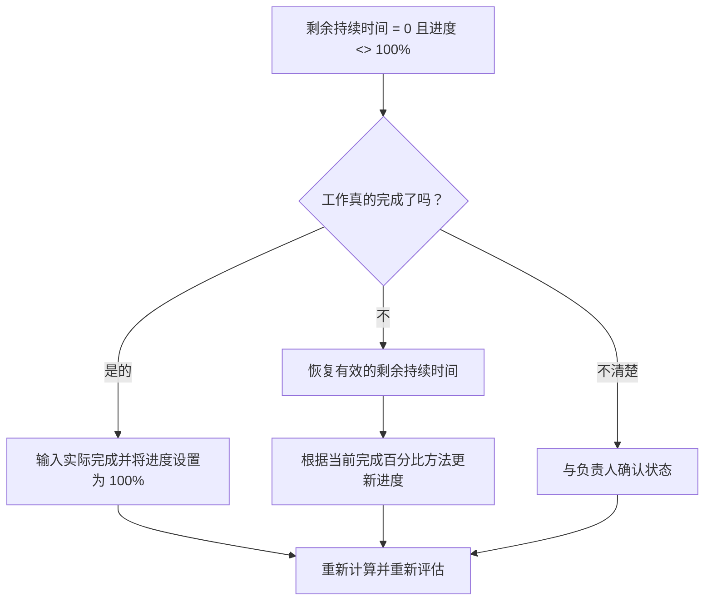

# 剩余持续时间为 0 且进度不是 100% 的活动 - 改进指南

## 目的

本指南帮助进度计划人员检查并纠正剩余持续时间等于 0 但进度不是 100% 的活动。它通过调整剩余持续时间、进度百分比、实际完成日期和活动​​状态，支持更清晰的 Primavera P6 状态更新。

## 开始之前

在采取行动之前收集以下信息：

- 该指标的当前评估结果。
- 剩余持续时间 = 0 且进度 <> 100% 的活动列表。
- 活动状态、实际开始、实际完成、原始持续时间、剩余持续时间和完成持续时间。
- 完成百分比类型和相关进度字段。
- 实物完成百分比、持续时间完成百分比、单位完成百分比和活动完成百分比。
- 数据日期和最新进度更新说明。
- 现场确认工作是否已完成或仍有剩余工作。

## 了解您的结果

良好的结果是剩余持续时间 = 0 的活动为零且进度低于或高于 100%。

可接受的结果可能包括罕见的记录案例，其中特定的完成百分比方法会产生临时报告差异，但这些情况应在正式报告之前解决。

结果不佳意味着计划中包含剩余工作和进度状态不一致的活动。这可能会产生不准确的报告、挣值问题或误导性的完成状态。

## 改进目标

目标是 0 个未解决的活动，剩余持续时间 = 0，进度 <> 100%。

目标是确认每项活动是否已完成、是否错误地更新了进度，或使用了需要审查的完成百分比方法。

## 行动计划

### 第 1 步：确定主要问题

创建 P6 布局或报告，过滤剩余持续时间等于 0 且进度不是 100% 的活动。包括活动 ID、活动名称、WBS、活动状态、实际开始、实际完成、原始持续时间、剩余持续时间、完成百分比类型、实际完成百分比、持续时间完成百分比、完成单位百分比和活动完成百分比。

回顾每项活动并询问：

- 工作真的完成了吗？
- 如果完成，实际完成日期是否缺失？
- 如果不完整，为什么剩余持续时间为 0？
- 使用的完整类型百分比是多少？
- 进度值是来自物理、持续时间还是单位进度？
- 这是状态更新错误还是进度计算问题？

### 第 2 步：应用建议的修复方法

如果工作已完成，则将活动更新为已完成。根据项目更新程序，输入实际完成日期，确认剩余工期为0，并确认进度为100%。

如果工作未完成，则恢复适当的剩余工期。与负责人确认剩余工作，并根据活动的完成百分比类型更新相关进度字段。

如果问题是由完成百分比方法引起的，请检查活动是否应使用实际完成百分比、持续时间完成百分比或完成单位百分比。不要随意更改完成百分比类型；使其与项目控制程序保持一致。

### 第 3 步：删除常见拦截器

常见的障碍包括不完整的现场更新、缺少实际完成日期、实际完成百分比和持续时间百分比之间的混淆以及从外部系统导入的进度未经验证。

另一个障碍是将剩余持续时间视为进度字段。剩余持续时间应代表完成活动还需要多少时间，而不仅仅是报告已完成的工作量。

### 第 4 步：验证更改

修正后重新计算进度计划。重新运行指标并确认每个剩余项目均已更正或分配用于后续操作。

检查已完成的活动、实际完成日期、进度报告、挣值输出和前瞻报告，以确认更正不会造成新的不一致。

## 改善计划

### 第一天：回顾和诊断

运行指标，确认数据日期，并将结果分为已完成工作缺失状态、剩余工期为零的未完成工作以及完成百分比方法问题。

### 第 2-3 天：实施优先行动

首先报告中使用的正确活动。根据需要更新实际完成时间、恢复剩余持续时间或更正进度值。

### 第 4-5 天：监控早期结果

重新计算进度计划并审查进度报告、已完成的活动列表和挣值输出。

### 第六天：最终调整

与负责的专业、现场领导或项目控制领导一起解决剩余的不确定事项。

### 第 7 天：重新评估和比较

再次运行评估并将结果与​​目标阈值进行比较。

## 追踪进度

使用简单的跟踪器来管理更正和批准。

| 日期 | 采取的行动 | 预期影响 | 结果/观察 | 下一步 |
| --- | --- | --- | --- | --- |
| [日期] | 审核了 RD 0 项且进度不是 100 项活动 | 识别状态不一致 | [观察结果] | 指定所有者 |
| [日期] | 输入实际完成日期并修正进度 | 对齐完成状态 | [观察结果] | 重新计算进度计划 |
| [日期] | 恢复剩余时间 | 更正未完成的活动状态 | [观察结果] | 重新评估指标 |

## 如果结果没有改善

如果结果没有改善，请检查导入、复制或计算的进度更新是否不一致。检查不同的团队是否使用不同的完成百分比方法，或者更新工作流程中是否缺少实际完成日期。

当未解决的项目影响关键、近乎关键、挣值、客户报告、付款或移交相关工作时，将其升级。

## 维护

在发布报告之前，请在每个更新周期中查看此指标。它应该与实际日期、剩余持续时间、完成百分比和活动状态检查一起成为标准更新验证的一部分。

## 摘要清单

- [ ] 当前结果已审核
- [ ] 目标阈值已确定
- [ ] 数据日期确认
- [ ] 已确定的主要问题
- [ ] 正确更新已完成的活动
- [ ] 根据需要输入实际完成日期
- [ ] 工作未完成时恢复剩余工期
- [ ] 已审查的完成类型百分比
- [ ] 进度计划重新计算
- [ ] 监测结果
- [ ] 重复评估
- [ ] 记录后续步骤
## 相关内容
- [剩余持续时间为 0 且进度不是 100% 的活动 - 概述](01_overview_template.md)
- [博客模板](03_blog_template.md)
- [什么是进度计划](../../03b_blogs_zh/01_WHAT%20A%20SCHEDULE%20IS/01_blog.md)
- [强大的逻辑](../../03b_blogs_zh/02_ROBUST%20LOGIC/02_ROBUST%20LOGIC.md)
