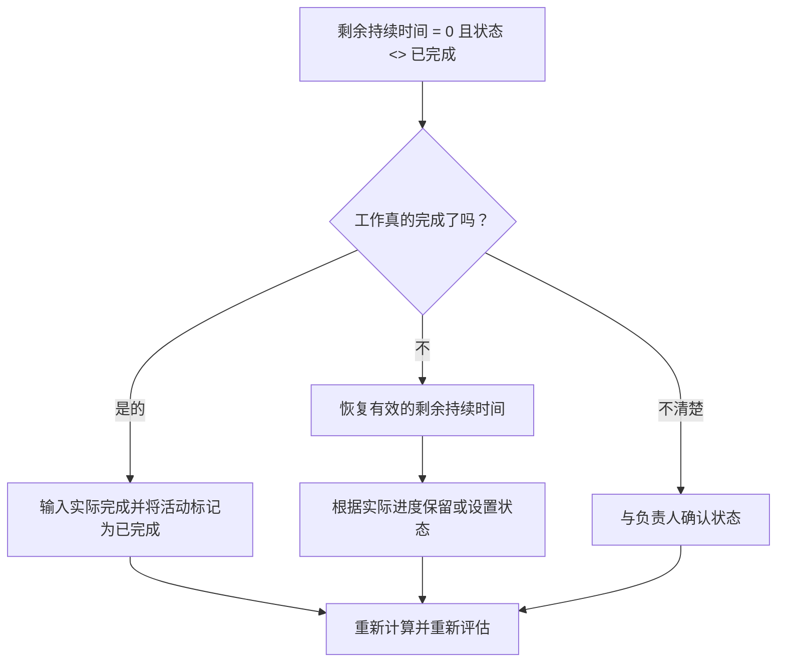

## 目的

本指南帮助进度计划人员检查并纠正剩余持续时间等于 0 但活动状态未完成的活动。它通过调整剩余持续时间、实际完成日期和活动​​状态来支持干净的 Primavera P6 更新。

## 开始之前

在采取行动之前收集以下信息：

- 该指标的当前评估结果。
- 剩余持续时间 = 0 且活动状态 <> 已完成的活动列表。
- 活动状态、实际开始、实际完成、原始持续时间、剩余持续时间和完成持续时间。
- 完成百分比类型和关键进度字段。
- 数据日期和最新更新说明。
- 现场确认工作是否已完成或仍有剩余工作。

## 了解您的结果

一个强有力的结果是零活动，剩余持续时间 = 0 并且状态未完成。

可接受的结果可能包括罕见的临时更新案例，但这些情况应在正式报告之前解决。

结果较差意味着计划中包含剩余时间和完成状态不一致的活动。这可能会产生误导性的进度报告、不完整的实现以及不可靠的前瞻或挣值输出。

## 改进目标

目标是 0 个未解决的活动，剩余持续时间 = 0，活动状态 <> 已完成。

目标是确认每项活动是否已完成并应关闭，或者是否未完成并应恢复有效的剩余持续时间。

## 行动计划

### 第 1 步：确定主要问题

创建 P6 布局或报告，用于筛选“剩余持续时间”等于 0 且“活动状态”未完成的活动。包括活动 ID、活动名称、WBS、活动状态、实际开始、实际完成、原始持续时间、剩余持续时间、完成百分比类型、活动完成百分比、开始、完成和总浮时。

回顾每项活动并询问：

- 工作真的完成了吗？
- 如果已完成，为什么活动状态未完成？
- 实际完成日期是否缺失？
- 如果工作未完成，为什么剩余工期为 0？
- 状态是手动导入还是更新的？
- 该活动是里程碑、LOE 活动还是其他特殊活动类型？

### 第 2 步：应用建议的修复方法

如果工作已完成，请将活动更新为“已完成”。输入实际完成时间，确认剩余工期为 0，并确认进度值与项目更新程序一致。

如果工作未完成，则恢复适当的剩余工期。与负责人确认剩余工作，并根据实际进度将活动状态保持为进行中或未开始。

如果问题来自导入的进度数据，请检查导入映射和更新工作流程。更新过程不应使活动的剩余时间为零但状态不完整。

### 第 3 步：删除常见拦截器

常见的障碍包括缺少实际完成日期、字段确认不完整、导入的更新数据以及持续时间状态和活动状态之间的混淆。

另一个障碍是在没有正式完成活动的情况下关闭剩余的持续时间。剩余持续时间和活动状态应该讲述关于工作是否剩余的相同故事。

### 第 4 步：验证更改

修正后重新计算进度计划。重新运行指标并确认每个剩余项目均已更正或分配用于后续操作。

检查已完成的活动列表、实际完成日期、进度报告、挣值输出和前瞻报告，以确认更正不会造成新的不一致。

## 改善计划

### 第一天：回顾和诊断

运行指标，确认数据日期，并将结果分为已完成的工作缺少已完成状态、剩余工期为零的未完成工作以及导入或工作流程问题。

### 第 2-3 天：实施优先行动

首先报告中使用的正确活动。输入“实际完成时间”，将活动标记为“已完成”，或根据需要恢复“剩余持续时间”。

### 第 4-5 天：监控早期结果

重新计算计划并审查已完成的活动报告、进度报告和挣值输出。

### 第六天：最终调整

与负责的专业、现场领导或项目控制领导一起解决剩余的不确定事项。

### 第 7 天：重新评估和比较

再次运行评估并将结果与​​目标阈值进行比较。

## 追踪进度

使用简单的跟踪器来管理更正和批准。

| 日期 | 采取的行动 | 预期影响 | 结果/观察 | 下一步 |
| --- | --- | --- | --- | --- |
| [日期] | 已审核 RD 0 且状态未完成的活动 | 识别状态不一致 | [观察结果] | 指定所有者 |
| [日期] | 输入实际完成并标记为已完成 | 对齐完成状态 | [观察结果] | 重新计算进度计划 |
| [日期] | 恢复剩余时间 | 更正未完成的活动状态 | [观察结果] | 重新评估指标 |

## 如果结果没有改善

如果结果没有改善，请检查导入、复制或手动编辑进度更新是否不一致。检查更新工作流程中是否缺少实际完成日期，或者用户是否在未完成活动的情况下将剩余持续时间设置为 0。

当未解决的项目影响关键、近乎关键、挣值、客户报告、付款或移交相关工作时，将其升级。

## 维护

在发布报告之前，请在每个更新周期中查看此指标。它应该与实际日期、剩余持续时间、完成百分比和活动状态检查一起成为标准更新验证的一部分。

## 摘要清单

- [ ] 当前结果已审核
- [ ] 目标阈值已确定
- [ ] 数据日期确认
- [ ] 已确定的主要问题
- [ ] 正确标记已完成的活动
- [ ] 根据需要输入实际完成日期
- [ ] 工作未完成时恢复剩余工期
- [ ] 导入或更新工作流程已选中
- [ ] 进度计划重新计算
- [ ] 监测结果
- [ ] 重复评估
- [ ] 记录后续步骤
## 相关内容
- [博客模板](03_blog_template.md)
- [什么是进度计划](../../03b_blogs_zh/01_WHAT%20A%20SCHEDULE%20IS/01_blog.md)
- [强大的逻辑](../../03b_blogs_zh/02_ROBUST%20LOGIC/02_ROBUST%20LOGIC.md)
