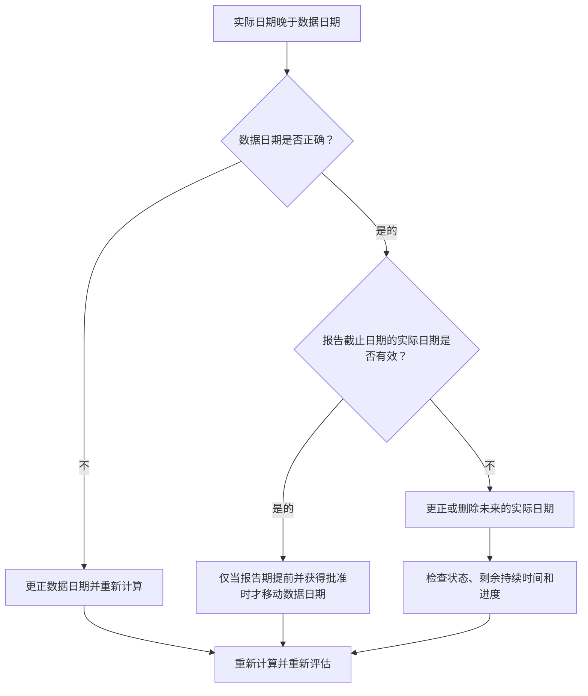

## 目的

本指南帮助进度计划员审查和纠正实际日期晚于 Primavera P6 数据日期的活动。它通过将实际性能保持在更新边界上或更新边界之前来支持干净的更新规则。

## 开始之前

在采取行动之前收集以下信息：

- 该指标的当前评估结果。
- 项目数据 最新计划更新中使用的日期。
- 实际日期大于数据日期的活动列表。
- 实际开始、实际完成、活动状态、剩余持续时间和完成百分比字段。
- 进度更新的来源，例如现场报告、导入文件、进度计划或手动更新。
- 项目更新截止规则和报告期。
- 任何已知的未来工作条目或数据导入问题。

## 了解您的结果

一个强有力的结果是实际日期晚于数据日期的零活动。

可接受的结果仍应为零。数据日期之后的实际日期通常表示更新错误或不正确的数据日期。

疲弱的结果意味着进度计划包含未来的实际情况。这可以使计划报告在更新周期实际到达该日期之前完成或开始工作。

## 改进目标

目标是 0 个未解决的活动，其实际日期大于数据日期。

目标是确认实际日期是否错误、数据日期是否错误，或者更新导入过程是否允许未来的实际值。

## 行动计划

### 第 1 步：确定主要问题

创建 P6 布局或报告，以筛选实际开始日期、实际完成日期或其他实际日期大于数据日期的活动。包括活动 ID、活动名称、WBS、活动状态、实际开始、实际完成、开始、完成、剩余持续时间、完成百分比、日历和数据日期参考。

回顾每项活动并询问：

- 项目数据日期是否正确？
- 实际日期正确吗？
- 更新是否包括截止日期之后的进展？
- 导入文件是否加载了未来的实际日期？
- 应该更改实际日期，还是应该移动数据日期？
- 活动状态与更正后的实际日期相符吗？

### 第 2 步：应用建议的修复方法

如果数据日期有误，请按照批准的报告期间更正并重新计算进度计划。

如果实际日期错误，请将实际开始或实际结束更正为正确的日期。如果工作在数据日期之前尚未实际开始或完成，请正确删除未来的实际和更新状态、剩余工期和完成百分比。

如果问题来自导入，请检查导入文件和映射。在发布计划报告之前，请确认未来的实际日期已被阻止或检查。

### 第 3 步：删除常见拦截器

常见的阻碍因素包括涵盖超出报告截止日期的日期的进度文件、未检查数据日期而输入的手动更新以及实际日期和预测日期之间的混淆。

另一个阻碍是移动数据日期只是为了接受未来的实际情况。数据日期应代表批准的更新边界，不得随意更改以隐藏状态错误。

### 第 4 步：验证更改

修正后重新计算进度计划。重新运行指标并确认数据日期之后没有剩余实际日期。

检查已完成的活动列表、进行中的活动列表、挣值输出和进度比较报告，以确认更正不会造成其他状态不一致。

## 改善计划

### 第一天：回顾和诊断

运行指标，确认数据日期，并将结果分为不正确的实际日期、不正确的数据日期、导入问题和更新截止问题。

### 第 2-3 天：实施优先行动

首先报告中使用的正确活动。修复实际日期、更新状态并解决导入问题。

### 第 4-5 天：监控早期结果

重新计算计划并审查进度报告、已完成的活动列表、挣值输出和里程碑日期。

### 第六天：最终调整

与负责的专业、现场领导或项目控制领导一起解决剩余的不确定事项。

### 第 7 天：重新评估和比较

再次运行评估并将结果与​​目标阈值进行比较。

## 追踪进度

使用简单的跟踪器来管理更正和批准。

| 日期 | 采取的行动 | 预期影响 | 结果/观察 | 下一步 |
| --- | --- | --- | --- | --- |
| [日期] | 在数据日期之后查看实际日期 | 确定未来的实际情况 | [观察结果] | 指定所有者 |
| [日期] | 更正的实际开始或实际结束 | 恢复有效状态边界 | [观察结果] | 重新计算进度计划 |
| [日期] | 审核导入流程 | 防止未来重复发生实际情况 | [观察结果] | 重新评估指标 |

## 如果结果没有改善

如果结果没有改善，请检查是否通过导入、进度计划或手动更新工作流程重复引入未来的实际值。查看更新截止程序并确认数据日期已明确传达给所有贡献者。

当未解决的项目影响关键、近乎关键、挣值、客户报告、付款或移交相关工作时，将其升级。

## 维护

在发布报告之前，请在每个更新周期中查看此指标。它应该与实际日期、数据日期、剩余持续时间、完成百分比和活动状态检查一起成为标准状态验证的一部分。

## 摘要清单

- [ ] 当前结果已审核
- [ ] 目标阈值已确定
- [ ] 数据日期确认
- [ ] 已确定的主要问题
- [ ] 更正的未来实际日期
- [ ] 检查活动状态
- [ ] 检查剩余持续时间和进度
- [ ] 导入或更新工作流程已审核
- [ ] 进度计划重新计算
- [ ] 监测结果
- [ ] 重复评估
- [ ] 记录后续步骤
## 相关内容
- [博客模板](03_blog_template.md)
- [什么是进度计划](../../03b_blogs_zh/01_WHAT%20A%20SCHEDULE%20IS/01_blog.md)
- [强大的逻辑](../../03b_blogs_zh/02_ROBUST%20LOGIC/02_ROBUST%20LOGIC.md)
