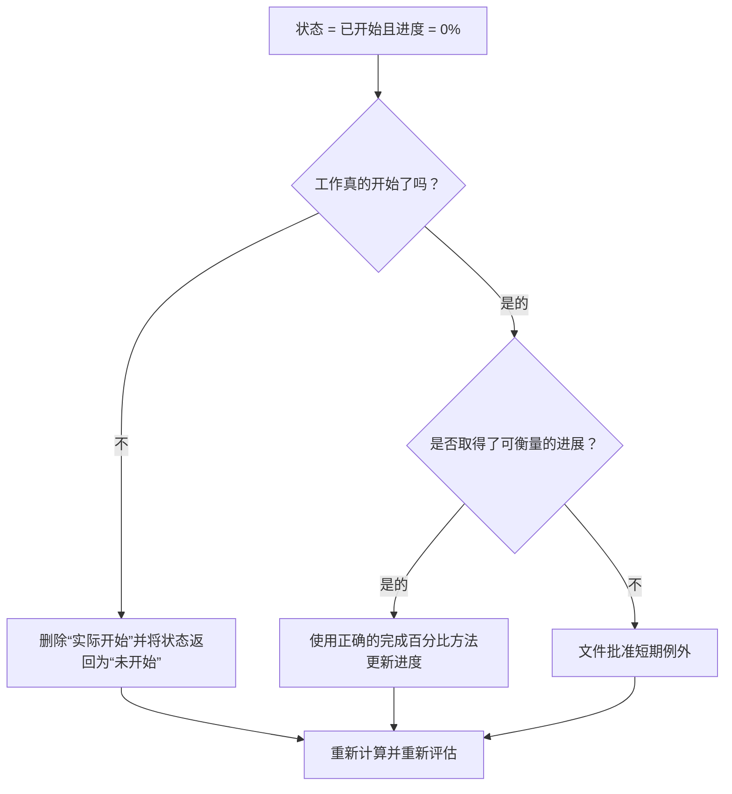

## 目的

本指南帮助进度计划员检查并纠正活动状态为“已开始”但进度为 0% 的活动。它通过调整实际开始、活动状态、完成百分比和剩余持续时间来支持更干净的 Primavera P6 更新。

## 开始之前

在采取行动之前收集以下信息：

- 该指标的当前评估结果。
- 活动状态 = 已开始且进度 = 0% 的活动列表。
- 实际开始、实际完成、剩余持续时间、原始持续时间和活动状态。
- 完成百分比类型和相关进度字段。
- 实物完成百分比、持续时间完成百分比、单位完成百分比和活动完成百分比。
- 数据日期和最新更新说明。
- 现场确认工作是否真正开始以及取得了哪些进展。

## 了解您的结果

一个强有力的结果是状态为“已开始”且进度为 0% 的活动为零。

可接受的结果可能包括罕见的记录案例，其中活动在更新期结束时开始，但尚未取得可衡量的进展。这些情况应该受到限制并得到明确解释。

结果较差意味着计划中包含开始状态和进度值不一致的活动。这可能会产生误导性的进度报告、挣值问题和前瞻性混乱。

## 改进目标

目标是 0 个未解决的活动，活动状态 = 已开始且进度 = 0%。

目标是确认每个活动是否真正开始，是否错过进度，或者活动是否应返回到“未开始”。

## 行动计划

### 第 1 步：确定主要问题

创建 P6 布局或报告，过滤状态为“已开始”且进度为 0% 的活动。包括活动 ID、活动名称、WBS、活动状态、实际开始、实际完成、原始持续时间、剩余持续时间、完成百分比类型、实际完成百分比、持续时间完成百分比、完成单位百分比、活动完成百分比、开始、完成和总浮时。

回顾每项活动并询问：

- 工作真的开始了吗？
- 如果工作开始，取得了哪些可衡量的进展？
- 实际开始是否正确？
- 使用的完整类型百分比是多少？
- 正确的领域是否缺少进展？
- 该活动是在没有实际工作开始的情况下以行政方式开始的吗？

### 第 2 步：应用建议的修复方法

如果工作并未实际开始，请删除不正确的“实际开始”并将活动返回到“未开始”。确认剩余期限和预测日期仍然有效。

如果工作确实开始并取得了进展，请根据完成百分比类型更新正确的进度字段。对于实物完成百分比，输入物理进度。对于完成时间百分比，确认剩余时间反映了已完成的工作。对于完成单位百分比，确认单位进度已更新。

如果工作已开始但没有取得可衡量的进展，请记录原因。这种情况应该是罕见且暂时的，例如在更新截止点附近记录的动员开始，但尚未取得任何进展。

### 第 3 步：删除常见拦截器

常见的阻碍因素包括缺少现场数量、导入没有进度值的实际开始、对完成百分比类型的混淆以及在可衡量的进度可用之前显示已启动工作的压力。

另一个阻碍因素是将“实际开始”视为计划信号而不是状态事实。实际开始应该代表真正的工作开始，而不是打算很快开始。

### 第 4 步：验证更改

修正后重新计算进度计划。重新运行指标并确认每个剩余项目均已更正、合理或分配用于后续工作。

检查进度报告、挣值输出、前瞻报告和进行中的活动列表，以确认更正不会造成新的不一致。

## 改善计划

### 第一天：回顾和诊断

运行指标，确认数据日期，并将结果分为不正确的开始、缺少进度、完成百分比方法问题和可能的异常。

### 第 2-3 天：实施优先行动

首先报告中使用的正确活动。删除不正确的实际开始、更新进度值或记录有效的异常。

### 第 4-5 天：监控早期结果

重新计算计划并审查进度报告、挣值输出、进行中的活动列表和前瞻报告。

### 第六天：最终调整

与负责的专业、现场领导或项目控制领导一起解决剩余的不确定事项。

### 第 7 天：重新评估和比较

再次运行评估并将结果与​​目标阈值进行比较。

## 追踪进度

使用简单的跟踪器来管理更正和批准。

| 日期 | 采取的行动 | 预期影响 | 结果/观察 | 下一步 |
| --- | --- | --- | --- | --- |
| [日期] | 审查已启动的活动，进度为 0% | 识别状态不一致 | [观察结果] | 指定所有者 |
| [日期] | 删除了不正确的实际开始 | 恢复准确状态 | [观察结果] | 重新计算进度计划 |
| [日期] | 更新的进度值 | 使开始状态与进度保持一致 | [观察结果] | 重新评估指标 |

## 如果结果没有改善

如果结果没有改善，请检查导入的实际开始是否没有匹配进度值，或者团队是否使用不同的规则来计算开始的数量。查看更新截止程序和完成百分比方法。

当未解决的项目影响关键、近乎关键、挣值、客户报告、付款或移交相关工作时，将其升级。

## 维护

在发布报告之前，请在每个更新周期中查看此指标。它应该与实际日期、剩余持续时间、完成百分比和活动状态检查一起成为标准更新验证的一部分。

## 摘要清单

- [ ] 当前结果已审核
- [ ] 目标阈值已确定
- [ ] 数据日期确认
- [ ] 已确定的主要问题
- [ ] 删除了不正确的实际开始时间
- [ ] 缺失的进度已更新
- [ ] 已审查的完成类型百分比
- [ ] 记录有效的异常情况
- [ ] 进度计划重新计算
- [ ] 监测结果
- [ ] 重复评估
- [ ] 记录后续步骤
## 相关内容
- [博客模板](03_blog_template.md)
- [什么是进度计划](../../03b_blogs_zh/01_WHAT%20A%20SCHEDULE%20IS/01_blog.md)
- [强大的逻辑](../../03b_blogs_zh/02_ROBUST%20LOGIC/02_ROBUST%20LOGIC.md)
