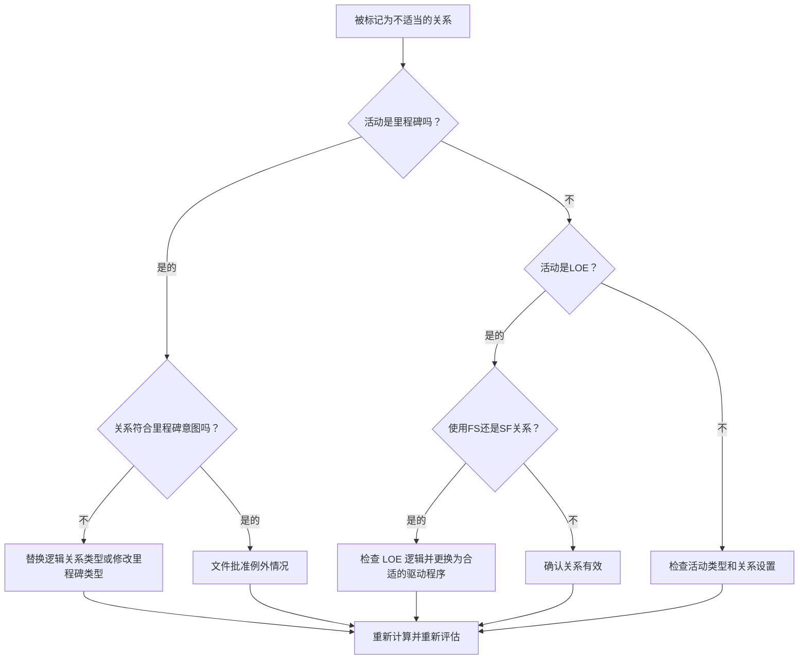

## 目的

本指南帮助进度计划员检查和纠正 Primavera P6 中涉及完成里程碑、开始里程碑和努力水平 (LOE) 活动的不恰当关系。

## 开始之前

在采取行动之前收集以下信息：

- 该指标的当前评估结果。
- 按前置活动、后续、活动类型和逻辑关系类型标记的关系列表。
- 活动 ID、活动名称、WBS、活动类型、开始、完成、总浮时以及关键或最长路径状态。
- 逻辑关系类型、滞后、前置活动类型和后续活动类型。
- 里程碑目的、LOE 目的和相关报告要求。
- 数据日期和最新计划计算输出。

## 了解您的结果

一个强有力的结果是，未解决的不恰当关系为零。

该指标应标记这些情况：

- 使用 SS 或 SF 后续活动完成里程碑。
- 与 SS 前置活动一起完成里程碑。
- 使用 FF 或 SF 前置活动的开始里程碑。
- 以 FS 或 FF 后续活动开始里程碑。
- LOE跟FS的关系。
- LOE与SF的关系。

可能存在罕见的例外情况，但应将其记录下来并在进度审查期间易于解释。

## 改进目标

目标是 0 个未解决的不体面关系。

目标是使每个里程碑和 LOE 关系与预期的进度计划行为相匹配，而不强制日期或隐藏弱逻辑。

## 行动计划

### 第 1 步：确定主要问题

创建 P6 布局或报告，显示所有里程碑和 LOE 活动以及前置和后续详细信息。包括活动类型、逻辑关系类型、滞后、开始、完成、总浮时以及关键或最长路径指示器。

查看每个标记的关系并询问：

- 活动类型是否正确？
- 逻辑关系类型是否符合里程碑或 LOE 的目的？
- 该关系是否试图强制开始、结束或报告日期？
- 正常的 FS、SS 或 FF 关系是否能更好地代表逻辑？
- 这种关系是否属于经批准的例外？

### 第 2 步：应用建议的修复方法

对于完成里程碑，确认逻辑正在驱动或响应完成。当 SS 或 SF 关系不代表真正的基于完成的依赖关系时，请替换它们。

对于开始里程碑，确认逻辑支持开始事件。当 FF、SF、FS 后续活动或其他不合适的关系用于强制报告日期时，请替换它们。

对于 LOE 活动，检查 FS 或 SF 关系是否错误地使 LOE 驱动离散工作。 LOE 活动通常总结或跨越其他工作，因此应谨慎处理它们的关系。

如果通过合同、客户方法或特殊进度计划设计关系有效，请记录原因和批准。

### 第 3 步：删除常见拦截器

常见的阻碍因素包括复制旧计划中的逻辑、​​误解里程碑行为、使用 SF 关系作为捷径，以及使用 LOE 活动来控制应由离散活动驱动的工作。

另一个障碍是将关系清理视为表面现象。这些链接可能会影响浮时、关键路径报告、里程碑日期和进度可信度。

### 第 4 步：验证更改

修正后重新计算进度计划。重新运行指标并确认每个剩余项目均已更正、合理或分配用于后续工作。

检查里程碑日期、LOE 日期、总浮时、关键或最长路径以及关键报告输出，以确认更正不会产生新问题。

## 改善计划

### 第一天：回顾和诊断

按活动类型和关系模式运行指标和分组结果。

### 第 2-3 天：实施优先行动

首先纠正关键、近乎关键、合同、移交和面向客户的里程碑上的关系。

### 第 4-5 天：监控早期结果

重新计算进度计划并审查浮时、关键路径、里程碑移动和 LOE 行为。

### 第六天：最终调整

与进度计划员、项目控制主管或 PMO 审核员一起解决剩余的异常情况。

### 第 7 天：重新评估和比较

再次运行评估并将结果与​​目标阈值进行比较。

## 追踪进度

使用简单的跟踪器来管理更正和批准。

| 日期 | 采取的行动 | 预期影响 | 结果/观察 | 下一步 |
| --- | --- | --- | --- | --- |
| [日期] | 审视不适当的关系 | 识别逻辑关系类型问题 | [观察结果] | 指定所有者 |
| [日期] | 更正了里程碑关系 | 使逻辑与里程碑目的保持一致 | [观察结果] | 重新计算进度计划 |
| [日期] | 审查 LOE 关系 | 防止 LOE 错误地驱动离散工作 | [观察结果] | 重新评估指标 |

## 如果结果没有改善

如果结果没有改善，请检查是否通过导入、复制逻辑、全局更改或外部计划集成重新引入相同的关系。

当未解决的项目影响合同里程碑、关键路径报告、客户提交、付款事件或移交日期时，将其升级。

## 维护

在每个更新周期期间和基线批准之前检查此指标。它在计划导入、复制片段、主要重新排序和里程碑修订之后特别有用。

## 摘要清单

- [ ] 当前结果已审核
- [ ] 目标阈值已确定
- [ ] 回顾了里程碑和 LOE 活动类型
- [ ] 检查标记的逻辑关系类型
- [ ] 纠正了不正确的关系
- [ ] 记录有效的异常情况
- [ ] 进度计划重新计算
- [ ] 审查浮时和关键路径
- [ ] 监测结果
- [ ] 重复评估
- [ ] 记录后续步骤
## 相关内容
- [03_blog_template](../14_unusual_relations/03_blog_template.md)
- [什么是进度计划](../../03b_blogs_zh/01_WHAT%20A%20SCHEDULE%20IS/01_blog.md)
- [强大的逻辑](../../03b_blogs_zh/02_ROBUST%20LOGIC/02_ROBUST%20LOGIC.md)
