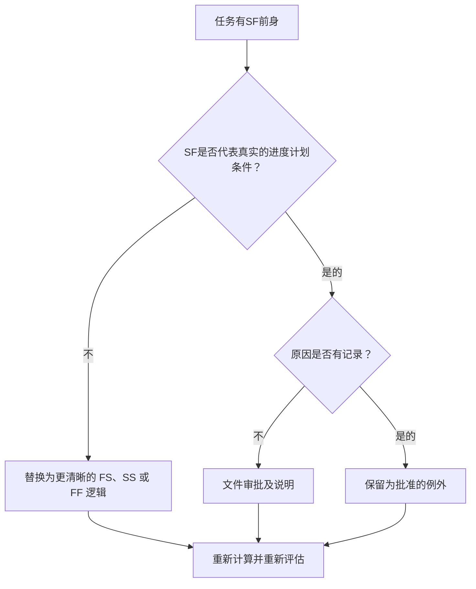

# 与 SF 前辈在 Primavera P6 中的任务活动 - 改进指南

## 目的

本指南帮助进度计划员检查和更正 Primavera P6 中具有开始到完成 (SF) 前置关系的任务活动。

## 开始之前

在采取行动之前收集以下信息：

- 该指标的当前评估结果。
- 至少有一个 SF 前置任务的任务活动列表。
- 活动 ID、活动名称、WBS、活动类型、开始、完成、总浮时以及关键或最长路径状态。
- 前置活动 ID、前置活动类型、逻辑关系类型和滞后。
- 任何限制、日历、预期完成条件以及相关更新说明。
- 数据日期和最新计划计算输出。

## 了解您的结果

一个强有力的结果是具有 SF 前置活动关系的未解决任务活动为零。

SF 关系意味着后续活动只有先行活动开始后才能完成。这在正常的施工、工程、采购或调试逻辑中并不常见。当大多数任务关系反映真实的排序时，应该用 FS、SS 或 FF 逻辑来表示。

薄弱的结果意味着任务活动的完成可能是由难以证明合理的逻辑控制的，或者是未经审查就从进度计划表的其他部分复制的。

## 改进目标

目标是任务活动中 0 个未解决的 SF 前趋关系。

目标是确认每个 SF 关系是否是有效的进度计划模型，或者应该用更清晰的逻辑替换。

## 行动计划

### 第 1 步：确定主要问题

创建 P6 布局或报告，以筛选具有 SF 前置任务的任务活动。包括前置和后续 ID、活动类型、逻辑关系类型、滞后、开始、完成、总浮时、约束以及关键或最长路径指示器。

检查每个关系并询问：

- SF 关系试图代表什么真实状况？
- 前置活动的开始真的应该控制后续的结束吗？
- FS、SS 或 FF 逻辑会更清楚地描述序列吗？
- 是否使用滞后来强制日期？
- 关系处于关键还是近乎关键路径上？
- 是否有使用 SF 的记录原因？

### 第 2 步：应用建议的修复方法

如果 SF 关系不代表真实条件，请将其替换为最能描述序列的逻辑关系类型。当后续应在前置活动完成后开始时使用 FS，当开始链接时使用 SS，当完成对齐是预期逻辑时使用 FF。

如果添加 SF 关系是为了控制完成日期，请检查计划是否需要适当的前置任务、里程碑、约束检查或活动拆分。

如果 SF 关系有效，请记录为什么需要它以及谁批准了它。这应该是一个罕见的例外，而不是常见的进度计划模式。

### 第 3 步：删除常见拦截器

常见的阻碍因素包括复制关系、导入外部逻辑、对 SF 行为的误解以及使用滞后的 SF 来强制完成日期。

另一个阻碍者正在离开这段关系，因为计算出的日期看起来可以接受。这种关系仍然需要在逻辑上站得住脚。

### 第 4 步：验证更改

修正后重新计算进度计划。重新运行指标并确认每个剩余的 SF 前置活动都已更正、合理或分配用于后续操作。

检查总浮时、关键或最长路径、受影响的里程碑和前瞻输出，以确认逻辑更改不会产生新问题。

## 改善计划

### 第一天：回顾和诊断

运行指标，确认数据日期，并将结果分为无效的 SF 关系、可能的异常以及需要所有者输入的项目。

### 第 2-3 天：实施优先行动

首先纠正关键、近乎关键、合同和近期活动上的 SF 关系。

### 第 4-5 天：监控早期结果

重新计算进度计划并审查浮时、关键路径、前瞻性日期和里程碑移动。

### 第六天：最终调整

与进度计划员、专业负责人、项目控制负责人或 PMO 审核员一起解决剩余的异常情况。

### 第 7 天：重新评估和比较

再次运行评估并将结果与​​目标阈值进行比较。

## 追踪进度

使用简单的跟踪器来管理更正和批准。

| 日期 | 采取的行动 | 预期影响 | 结果/观察 | 下一步 |
| --- | --- | --- | --- | --- |
| [日期] | 与 SF 前辈一起审查任务活动 | 识别异常关系逻辑 | [观察结果] | 指定所有者 |
| [日期] | 替换了无效的 SF 关系 | 提高逻辑清晰度 | [观察结果] | 重新计算进度计划 |
| [日期] | 记录有效的 SF 例外 | 保留批准的特殊逻辑 | [观察结果] | 重新评估指标 |

## 如果结果没有改善

如果结果没有改善，请检查是否通过导入、复制片段、全局更改或外部计划集成重新引入 SF 关系。

当未解决的项目影响关键路径、合同里程碑、客户提交、付款事件或近期执行工作时，将其升级。

## 维护

在每个更新周期期间和基线批准之前检查此指标。它在计划导入、主要重新排序和逻辑清理练习之后特别有用。

## 摘要清单

- [ ] 当前结果已审核
- [ ] 目标阈值已确定
- [ ] 已生成 SF 前置活动列表
- [ ] 关键和近乎关键的项目优先
- [ ] 无效的 SF 关系已更正
- [ ] 记录有效的异常情况
- [ ] 进度计划重新计算
- [ ] 审查浮时和关键路径
- [ ] 监测结果
- [ ] 重复评估
- [ ] 记录后续步骤
## 相关内容
- [与 SF 前辈在 Primavera P6 中的任务活动 - 概述](01_overview_template.md)
- [与 SF 前辈在 Primavera P6 中的任务活动](03_blog_template.md)
- [什么是进度计划](../../03b_blogs_zh/01_WHAT%20A%20SCHEDULE%20IS/01_blog.md)
- [强大的逻辑](../../03b_blogs_zh/02_ROBUST%20LOGIC/02_ROBUST%20LOGIC.md)
