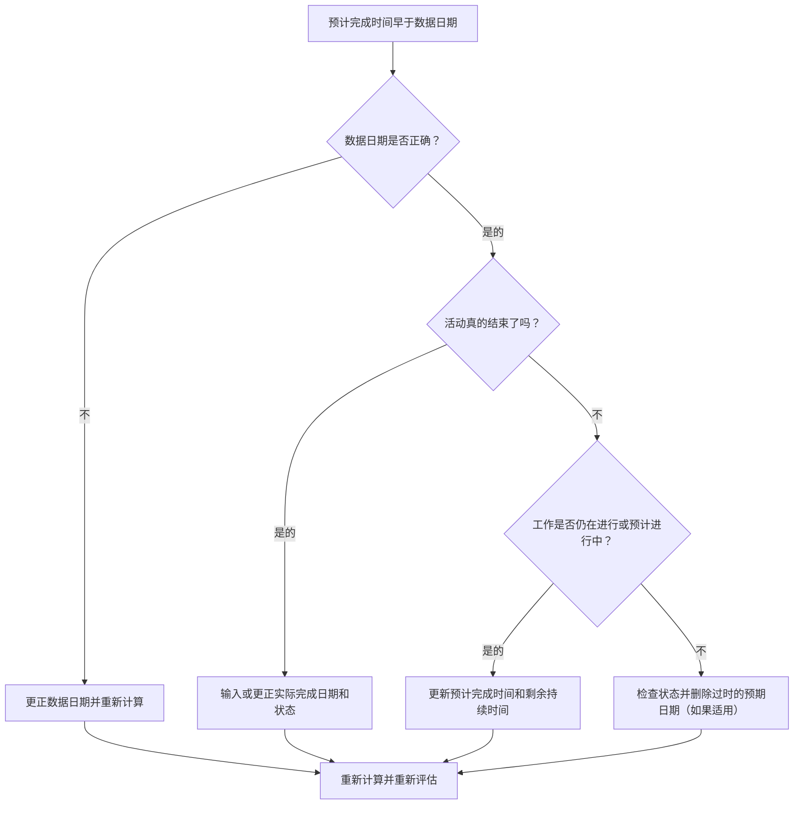

# Primavera P6 预计在数据日期之前完成 - 改进指南

## 目的

本指南帮助进度计划员审查和纠正预期完成日期早于 Primavera P6 数据日期的活动。它通过使预期日期与当前报告边界保持一致来支持更清晰的更新规则。

## 开始之前

在采取行动之前收集以下信息：

- 该指标的当前评估结果。
- 项目数据 最新计划更新中使用的日期。
- 预期完成时间早于数据日期的活动列表。
- 活动状态、实际开始、实际完成、剩余持续时间、完成百分比、开始、完成和总浮时。
- 预期完成来源，例如手动输入、导入文件、现场预测或 P6 更新工作流程。
- 项目更新截止规则和最新进度说明。

## 了解您的结果

一个好的结果是预期完成时间早于数据日期的零活动。

数据日期之前的预期完成通常意味着当计划向前推进时，预测或预期完成信息未更新。它还可能指示活动应具有实际完成时间、修订的剩余持续时间或更正的状态。

弱结果意味着计划包含相对于当前更新边界而言过去的预期完成日期。

## 改进目标

目标是 0 项未解决的活动，预计完成时间早于数据日期。

目标是确认每项活动是否已完成、仍在进行、未开始或更新不正确。

## 行动计划

### 第 1 步：确定主要问题

创建 P6 布局或报告，以筛选预期完成时间早于数据日期的活动。包括活动 ID、活动名称、WBS、活动状态、预期完成、实际开始、实际完成、剩余持续时间、完成百分比、开始、完成、总浮时和日历。

回顾每项活动并询问：

- 数据日期是否正确？
- 该活动实际上是否在数据日期之前完成？
- 如果完成了，实际完成度是否缺失？
- 如果没有完成，预期完成是否应该更新？
- 剩余工期还代表剩余的工作吗？
- 导入或手动更新是否留下了旧的预期完成值？

### 第 2 步：应用建议的修复方法

如果数据日期有误，请按照批准的报告期间更正并重新计算进度计划。

如果活动在数据日期之前完成，请输入或更正实际完成日期并确认活动状态、完成百分比和剩余持续时间一致。

如果活动仍处于活动状态或未完成，请将预期完成时间更新为数据日期当天或之后的有效日期。确认剩余工期和预测日期反映最新的现场信息。

如果预期完成时间是通过导入引入的，请检查导入文件和映射，以便不会重复加载过时的预期日期。

### 第 3 步：删除常见拦截器

常见的阻碍因素包括过时的现场预测、更新完成百分比但不更新预期日期的进度导入，以及预期完成、预测完成和实际完成之间的混淆。

另一个障碍是忽略预期完成时间，因为预定的日期看起来可以接受。在 P6 中，预期日期可能会根据设置和工作流程影响计划计算，因此应审查过时的值。

### 第 4 步：验证更改

修正后重新计算进度计划。重新运行指标并确认数据日期之前没有未解决的预期完成日期。

审查正在进行的活动、近期展望、总浮时、里程碑日期和进度比较报告，以确认更正不会造成新的不一致。

## 改善计划

### 第一天：回顾和诊断

运行指标，确认数据日期，并将结果分为已完成的工作、过时的预期日期、剩余持续时间问题和导入问题。

### 第 2-3 天：实施优先行动

首先报告中使用的正确活动。根据需要更新实际完成时间、预期完成时间、剩余持续时间、完成百分比或活动状态。

### 第 4-5 天：监控早期结果

重新计算计划并查看前瞻报告、正在进行的活动列表、里程碑移动和浮时变化。

### 第六天：最终调整

与负责的专业、现场领导或项目控制领导一起解决剩余的不确定事项。

### 第 7 天：重新评估和比较

再次运行评估并将结果与​​目标阈值进行比较。

## 追踪进度

使用简单的跟踪器来管理更正和批准。

| 日期 | 采取的行动 | 预期影响 | 结果/观察 | 下一步 |
| --- | --- | --- | --- | --- |
| [日期] | 在数据日期之前审查预期完成情况 | 确定过时的预期日期 | [观察结果] | 指定所有者 |
| [日期] | 更新的预期完成或实际完成 | 将状态与更新边界对齐 | [观察结果] | 重新计算进度计划 |
| [日期] | 审核导入流程 | 防止重复过时的预期日期 | [观察结果] | 重新评估指标 |

## 如果结果没有改善

如果结果没有改善，请检查是否在未经验证的情况下从现场系统、电子表格或以前的更新文件导入了预期日期。查看更新工作流程并确认谁拥有预期完成更新。

当未解决的项目影响关键、近乎关键、客户报告、付款、移交或近期执行工作时，将其升级。

## 维护

在发布报告之前，请在每个更新周期中查看此指标。它应该与数据日期、实际日期、剩余持续时间、完成百分比和活动状态检查一起成为标准状态验证的一部分。

## 摘要清单

- [ ] 当前结果已审核
- [ ] 目标阈值已确定
- [ ] 数据日期确认
- [ ] 生成预期完成列表
- [ ] 根据实际完成日期已完成的工作
- [ ] 过时的预计完成日期已更新
- [ ] 已检查剩余持续时间
- [ ] 检查活动状态和完成百分比
- [ ] 导入或更新工作流程已审核
- [ ] 进度计划重新计算
- [ ] 重复评估
- [ ] 记录后续步骤
## 相关内容
- [Primavera P6 预计在数据日期之前完成 - 概述](01_overview_template.md)
- [Primavera P6 预计在数据日期之前完成](03_blog_template.md)
- [什么是进度计划](../../03b_blogs_zh/01_WHAT%20A%20SCHEDULE%20IS/01_blog.md)
- [强大的逻辑](../../03b_blogs_zh/02_ROBUST%20LOGIC/02_ROBUST%20LOGIC.md)
