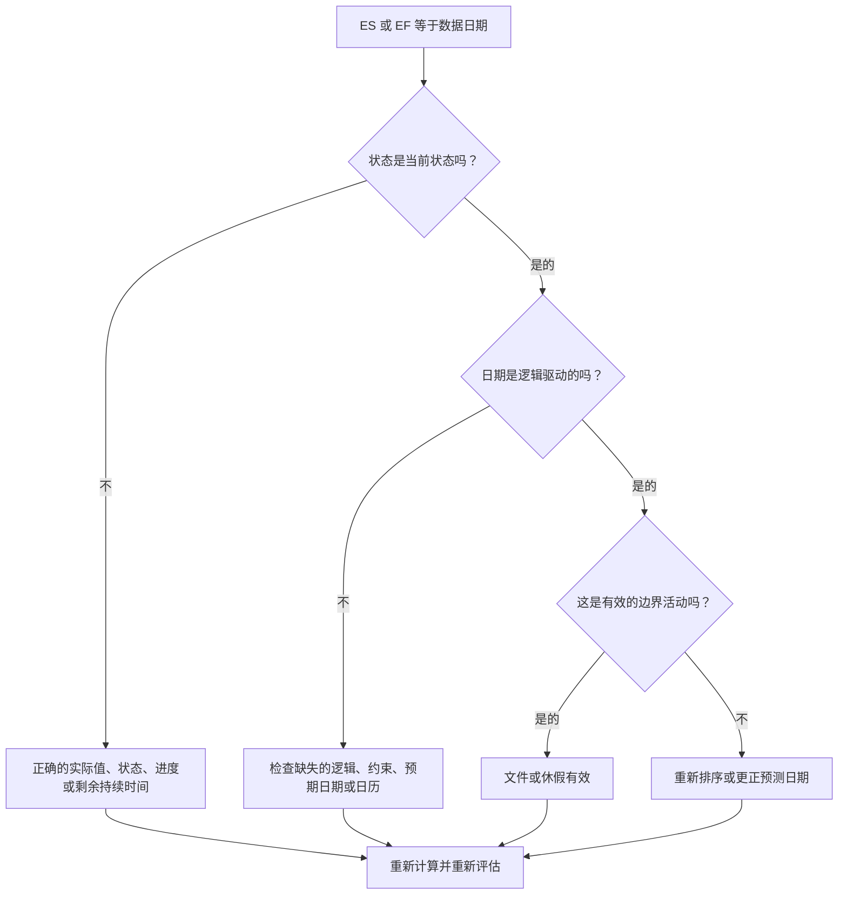

# 数据日期的活动 - 改进指南

## 目的

本指南可帮助进度计划员审查提前开始或提前结束恰好在 Primavera P6 数据日期的活动。它通过显示实际绩效和预测工作之间边界上的工作收集位置来支持更新周期检查。

## 开始之前

在采取行动之前收集以下信息：

- 该指标的当前评估结果。
- 项目数据 用于最新进度计算的日期。
- 活动列表，其中提前开始 = 数据日期。
- 活动列表，其中提前完成 = 数据日期。
- 活动状态、实际开始、实际完成、剩余持续时间、开始、完成、总浮时和日历。
- 前置活动和后续活动关系详细信息。
- 限制、预期日期和更新说明。

## 了解您的结果

一个强有力的结果是在数据日期提前开始或提前结束的不明活动为零。

某些活动可能合法地位于数据日期，特别是准备在更新边界继续进行或完成的近期工作。问题不在于日期本身，而在于日期。问题在于该日期是否由有效的状态、逻辑和更新信息来解释。

结果不佳意味着许多活动在数据日期收集，但没有明确的计划原因。

## 改进目标

目标是 0 个无法解释的活动，其中 ES = 数据日期或 EF = 数据日期。

目标是确认每个活动是否得到正确的状态、逻辑驱动以及从正确的更新边界进行预测。

## 行动计划

### 第 1 步：确定主要问题

创建 P6 布局或报告，以筛选“提前开始”等于“数据日期”或“提前完成”等于“数据日期”的活动。包括活动 ID、活动名称、WBS、活动状态、提前开始、提前完成、开始、完成、实际开始、实际完成、剩余持续时间、总浮时、日历、约束、前置任务和后续任务。

回顾每项活动并询问：

- 活动是否已完成、正在进行或尚未开始？
- 是否缺少实际开始或实际结束？
- 活动是否在逻辑上驱动到数据日期？
- 是否有约束、预期日期或日历将活动推至数据日期？
- 活动是开放式的还是弱联系的？
- 更新期间的数据日期是否正确？

### 第 2 步：应用建议的修复方法

如果状态不完整，请在更改逻辑之前更正实际开始、实际完成、剩余持续时间、完成百分比和活动状态。

如果由于前置逻辑缺失或未驱动而导致活动在数据日期开始，请添加或更正代表实际工作顺序的关系。

如果由于进度未更新而导致活动在数据日期完成，请确认工作是否在更新边界之前完成。如果已完成，请输入实际完成时间；如果还有工作，请更新剩余工期和预测完成时间。

如果限制或预期日期将活动推至数据日期，请根据项目控制程序删除、修改或记录它们。

### 第 3 步：删除常见拦截器

常见的障碍包括不完整的实现、开放的开始、开放的结束、用作逻辑替代的约束以及没有足够的状态审查的数据日期移动。

另一个阻碍因素是假设数据日期上的活动是无害的。更新边界处的大簇可以隐藏缺失的排序或使近期预测看起来比实际情况更清晰。

### 第 4 步：验证更改

修正后重新计算进度计划。重新运行指标并确认数据日期的每个剩余活动均由当前状态、有效逻辑或批准的例外进行解释。

检查总浮时、关键或最长路径、里程碑日期和近期前瞻报告，以确认更正不会造成新的不一致。

## 改善计划

### 第一天：回顾和诊断

运行指标，确认数据日期，并将结果分为数据日期的 ES、数据日期的 EF、状态问题、逻辑问题、约束和有效边界活动。

### 第 2-3 天：实施优先行动

首先纠正关键、近乎关键和近期活动。更新状态、添加或更正逻辑以及检查约束。

### 第 4-5 天：监控早期结果

重新计算计划并审查前瞻输出、浮时变化、里程碑移动以及仍在数据日期的活动。

### 第六天：最终调整

与负责的专业、现场领导或项目控制领导一起解决剩余的不确定事项。

### 第 7 天：重新评估和比较

再次运行评估并将结果与​​目标阈值进行比较。

## 追踪进度

使用简单的跟踪器来管理更正和批准。

| 日期 | 采取的行动 | 预期影响 | 结果/观察 | 下一步 |
| --- | --- | --- | --- | --- |
| [日期] | 在数据日期审查了 ES/EF | 识别边界聚类 | [观察结果] | 指定所有者 |
| [日期] | 更正状态或实际日期 | 使工作状态与更新边界保持一致 | [观察结果] | 重新计算进度计划 |
| [日期] | 更正逻辑或约束 | 减少无法解释的数据日期聚类 | [观察结果] | 重新评估指标 |

## 如果结果没有改善

如果结果没有改善，请检查活动是否由于缺少逻辑、约束、过时的预期日期或不完整的更新过程而被重复拉至数据日期。

当未解决的项目影响关键、近乎关键、客户报告、移交、付款或近期执行工作时，将其升级。

## 维护

在发布报告之前，请在每个更新周期中查看此指标。在移动数据日期、导入进度、重新排序工作或在主要状态更改后重新计算后，它特别有用。

## 摘要清单

- [ ] 当前结果已审核
- [ ] 目标阈值已确定
- [ ] 数据日期确认
- [ ] ES = 审查活动的数据日期
- [ ] EF = 审查活动的数据日期
- [ ] 检查状态和实际日期
- [ ] 已检查剩余持续时间
- [ ] 审查逻辑和约束
- [ ] 记录有效的边界活动
- [ ] 进度计划重新计算
- [ ] 重复评估
- [ ] 记录后续步骤
## 相关内容
- [数据日期的活动：Primavera P6 中的提前开始和提前完成检查 - 概述](01_overview_template.md)
- [数据日期的活动：Primavera P6 中的提前开始和提前完成检查](03_blog_template.md)
- [什么是进度计划](../../03b_blogs_zh/01_WHAT%20A%20SCHEDULE%20IS/01_blog.md)
- [强大的逻辑](../../03b_blogs_zh/02_ROBUST%20LOGIC/02_ROBUST%20LOGIC.md)
