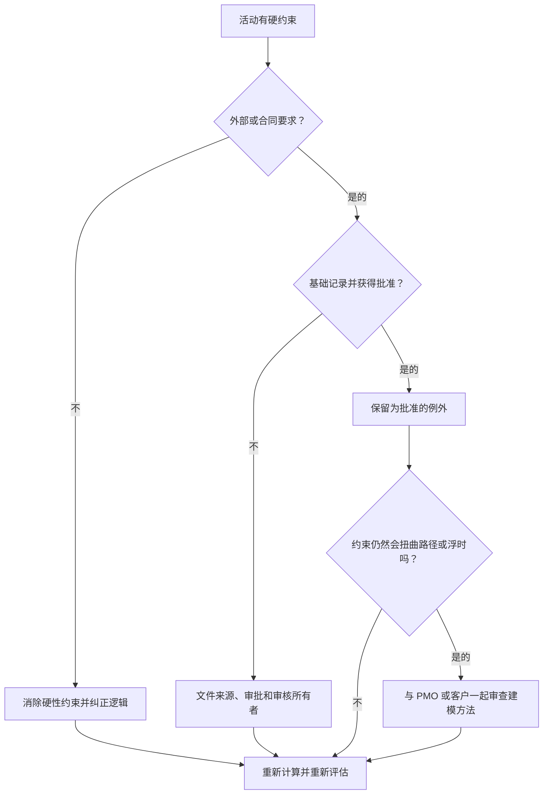

# Primavera P6 中的硬约束 - 改进指南

## 目的

本指南帮助进度计划员审查和减少 Primavera P6 中的硬约束。它重点关注严格控制活动日期的约束，尤其是强制开始和强制结束。

## 开始之前

在采取行动之前收集以下信息：

- 该指标的当前评估结果。
- 具有硬约束的活动列表。
- 每个活动的约束类型和约束日期。
- 活动 ID、活动名称、WBS、活动状态、开始、完成、总浮时以及关键或最长路径状态。
- 前置活动和后续活动关系详细信息。
- 任何所需约束的合同、客户、许可、访问、监管或移交依据。
- 显示添加约束的时间的基线或先前更新比较。

## 了解您的结果

一个强有力的结果是零无法解释的硬约束。

硬约束可以覆盖或严重限制正常的 CPM 计算。它们可能对合同日期、访问窗口、许可证发布、监管保留点或所有者指定的要求有效，但它们不应用作缺失逻辑的替代品。

弱结果意味着进度计划包含可能控制预测而不是网络逻辑的强加日期。

## 改进目标

目标是 0 个无法解释的硬约束。

目标是消除不必要的硬约束并记录真正需要的任何约束。

## 行动计划

### 第 1 步：确定主要问题

创建 P6 布局或报告，以筛选具有硬约束类型的活动。包括活动 ID、活动名称、WBS、活动状态、开始、完成、约束类型、约束日期、总浮时、关键或最长路径状态、前置任务和后续任务。

检查每项受限活动并询问：

- 硬约束的根源是什么？
- 是合同规定的还是外部规定的？
- 它是否取代了缺失的前置活动或后续逻辑？
- 它是否强制规定了进度计划应该预测的目标日期？
- 它会影响总浮时、关键路径或里程碑报告吗？
- 原因是否已记录并获得批准？

### 第 2 步：应用建议的修复方法

如果外部不需要硬约束，请将其删除并添加或更正 CPM 逻辑。使用关系、活动排序、日历和实际持续时间来建模工作，而不是强制日期。

如果需要硬约束，请记录基础。捕获来源、批准、日期、责任所有者以及无法使用正常逻辑建模的原因。

如果使用约束来保留目标日期，请检查较软的约束、里程碑、截止日期或报告说明是否更合适。

### 第 3 步：删除常见拦截器

常见的障碍包括从旧基线继承的约束、作为强制日期输入的客户目标日期、留下临时约束的恢复计划以及缺失的界面逻辑。

另一个阻碍因素是假设硬约束是可以接受的，因为日期很重要。重要的日期应该是可见的，但进度计划仍然应该解释工作如何到达这些日期。

### 第 4 步：验证更改

修正后重新计算进度计划。重新运行指标并确认剩余的硬约束已获得批准并记录。

检查总浮时、关键或最长路径、里程碑日期和计划比较输出，以确认修正不会造成意外的移动。

## 改善计划

### 第一天：回顾和诊断

按 WBS、约束类型、关键性和记录依据运行指标和组结果。

### 第 2-3 天：实施优先行动

首先消除关键、近乎关键、合同和近期活动中不必要的硬性约束。在需要的地方添加缺失的逻辑。

### 第 4-5 天：监控早期结果

重新计算进度计划并审查浮时变动、关键路径变化和里程碑影响。

### 第六天：最终调整

与进度计划员、项目控制主管、PMO 审核员或客户代表一起解决剩余的异常情况。

### 第 7 天：重新评估和比较

再次运行评估并将结果与​​目标阈值进行比较。

## 追踪进度

使用简单的跟踪器来管理更正和批准。

| 日期 | 采取的行动 | 预期影响 | 结果/观察 | 下一步 |
| --- | --- | --- | --- | --- |
| [日期] | 审查硬约束 | 确定实施的日期控制 | [观察结果] | 指定所有者 |
| [日期] | 删除了不必要的硬约束 | 恢复逻辑驱动的计算 | [观察结果] | 重新计算进度计划 |
| [日期] | 记录批准的硬约束 | 保留合理的异常 | [观察结果] | 重新评估指标 |

## 如果结果没有改善

如果结果没有改善，请检查是否通过导入、复制碎片、基线更新或恢复计划更改重新引入硬约束。

当未解决的项目影响关键路径、合同里程碑、客户报告、延迟分析、付款事件或移交日期时，将其升级。

## 维护

在每个更新周期期间和基线批准之前检查此指标。硬约束应该成为标准计划健康检查的一部分，特别是在重大重新排序、恢复计划和客户提交准备之后。

## 摘要清单

- [ ] 当前结果已审核
- [ ] 目标阈值已确定
- [ ] 生成硬约束列表
- [ ] 约束类型和检查日期
- [ ] 外部基础已确认
- [ ] 删除不必要的硬性约束
- [ ] 已更正缺失的逻辑
- [ ] 记录批准的例外情况
- [ ] 进度计划重新计算
- [ ] 审查浮时和关键路径
- [ ] 重复评估
- [ ] 记录后续步骤
## 相关内容
- [Primavera P6 中的硬约束 - 概述](01_overview_template.md)
- [Primavera P6 中的硬约束](03_blog_template.md)
- [什么是进度计划](../../03b_blogs_zh/01_WHAT%20A%20SCHEDULE%20IS/01_blog.md)
- [强大的逻辑](../../03b_blogs_zh/02_ROBUST%20LOGIC/02_ROBUST%20LOGIC.md)
