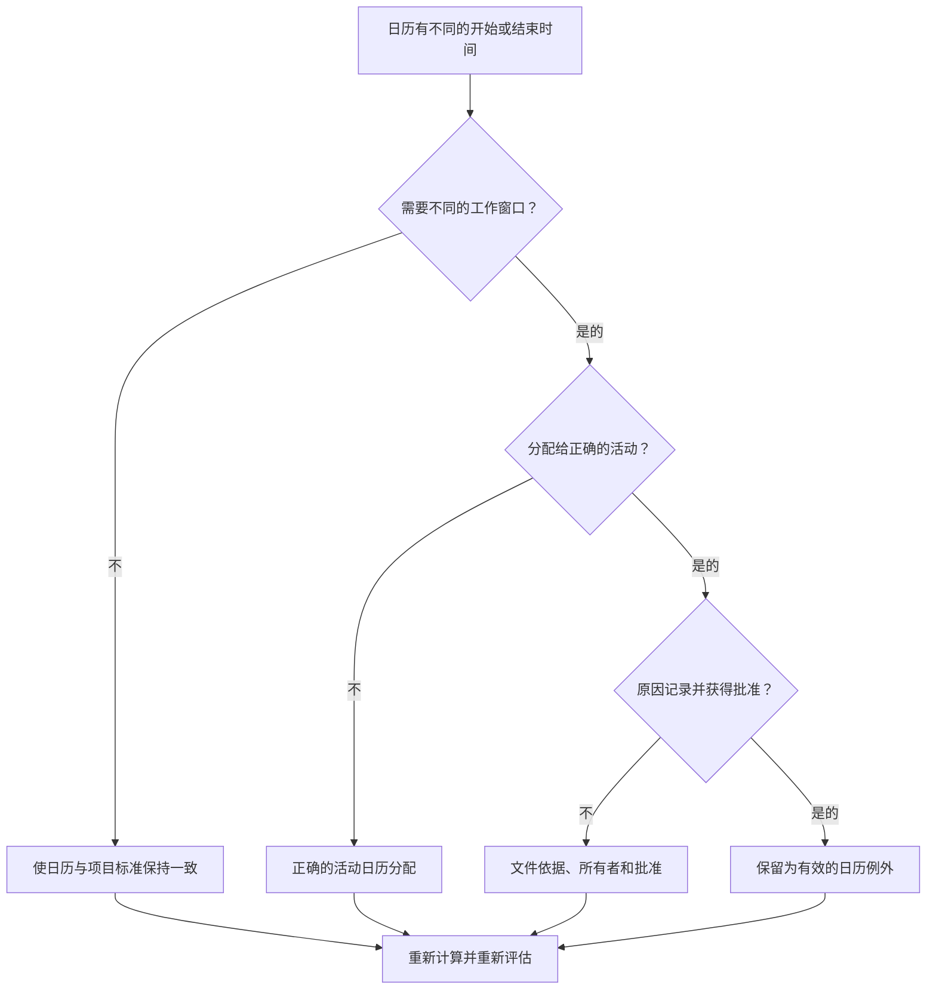

# Primavera P6 中具有不同开始和结束时间的日历 - 改进指南

## 目的

本指南帮助进度计划员查看使用不同工作日开始或结束时间的 Primavera P6 日历。它通过确认日历时间差异是故意的、批准的和理解的来支持计划质量检查。

## 开始之前

在采取行动之前收集以下信息：

- 该指标的当前评估结果。
- 批准的项目日历标准和正常的日常工作窗口。
- 具有不同开始时间、结束时间、轮班窗口或部分日期模式的日历列表。
- 分配给每个受影响的日历的活动。
- 日历类型，例如全局日历、项目日历或资源日历。
- 使用受影响日历的关键或近乎关键的活动。
- 每个非标准日历的原因，例如夜班、停电工作、限制访问或特殊的工作人员进度计划。

## 了解您的结果

一个强有力的结果是零具有不同开始或结束时间的无法解释的日历。

当工作真正遵循不同的轮班、访问窗口或资源可用性时，日历差异可能是有效的。令人担忧的是，日历在一天中的不同时间会发生变化，而且没有明确的原因。

弱结果意味着进度计划可能包含影响日期、浮时和逻辑行为的隐藏日历假设。

## 改进目标

目标是 0 个具有不同开始或结束时间的无法解释的日历。

目标是确认每个不同的工作窗口是否需要、记录并仅分配给正确的活动。

## 行动计划

### 第 1 步：确定主要问题

从 P6 或进度评估工具创建日历审核导出，列出每个日历、其正常工作日开始时间、结束时间、每日工作时间、例外情况和分配的活动。

查看每个非标准日历并询问：

- 该项目批准的标准工作日是多少？
- 哪些日历使用不同的开始或结束时间？
- 这些差异是有意为之还是偶然？
- 哪些活动使用每个日历？
- 关键或近乎关键的活动是否受到影响？
- 日历差异是否已记录并获得批准？

### 第 2 步：应用建议的修复方法

如果日历差异是偶然的，请将开始时间、结束时间和每日工作周期与批准的项目标准对齐。

如果日历差异有效，请记录原因。常见的有效案例包括夜班、周末工作、关闭窗口、业主访问限制、环境限制或特定于资源的工作时间段。

如果活动分配给了错误的日历，请在更改日历本身之前更正活动日历分配。如果分配的范围太广，有效的特殊日历仍然会产生问题。

### 第 3 步：删除常见拦截器

常见的阻止因素包括从旧计划复制的日历、具有隐藏时间设置的导入日历、用作活动日历的资源日历以及标准日期布局中不可见的小时间差异。

另一个拦截器只查看日期而不查看时间。在 P6 中，一天中的时间会影响活动安排、浮时、关系行为和明显的一日日期移动。

### 第 4 步：验证更改

日历修正后重新计算进度计划。重新运行指标并确认剩余的日历差异有效并记录在案。

审查受影响的活动日期、总浮时、关键或最长路径、关系关系和近期前瞻性报告，以确认修正不会造成意外的变动。

## 改善计划

### 第一天：回顾和诊断

按日历、工作窗口、日历类型、分配的活动和重要性运行指标和分组结果。

### 第 2-3 天：实施优先行动

首先纠正关键、近乎关键和近期活动的意外日历时间差异和错误的活动日历分配。

### 第 4-5 天：监控早期结果

重新计算进度计划并审查浮时变动、日期变化、里程碑影响和前瞻变化。

### 第六天：最终调整

与进度计划员、专业负责人、项目控制负责人或 PMO 审核员一起解决剩余的日历异常。

### 第 7 天：重新评估和比较

再次运行评估并将结果与​​目标阈值进行比较。

## 追踪进度

使用简单的跟踪器来管理更正和批准。

| 日期 | 采取的行动 | 预期影响 | 结果/观察 | 下一步 |
| --- | --- | --- | --- | --- |
| [日期] | 检查日历开始和结束时间 | 识别非标准工作窗口 | [观察结果] | 指定所有者 |
| [日期] | 根据项目标准调整日历 | 消除意外的时差 | [观察结果] | 重新计算进度计划 |
| [日期] | 记录有效的日历异常 | 保留合理的工作窗口 | [观察结果] | 重新评估指标 |

## 如果结果没有改善

如果结果没有改善，请检查是否通过导入、复制计划、资源分配或基线更新重新引入非标准日历。

当未解决的日历差异影响关键路径、客户报告、付款里程碑、停电工作、移交日期或近期执行时，将其升级。

## 维护

在基线开发、计划导入和每个主要更新周期期间审查此指标。日历时间设置应成为发布报告之前标准计划运行状况检查的一部分。

## 摘要清单

- [ ] 当前结果已审核
- [ ] 目标阈值已确定
- [ ] 项目日历标准已确定
- [ ] 识别出非标准日历时间
- [ ] 审查分配的活动
- [ ] 检查了严重和近乎严重的影响
- [ ] 修正了意外的日历差异
- [ ] 记录有效的日历例外情况
- [ ] 进度计划重新计算
- [ ] 审查日期和浮时变化
- [ ] 重复评估
- [ ] 记录后续步骤
## 相关内容
- [Primavera P6 中具有不同开始和结束时间的日历 - 概述](01_overview_template.md)
- [Primavera P6 中具有不同开始和结束时间的日历](03_blog_template.md)
- [什么是进度计划](../../03b_blogs_zh/01_WHAT%20A%20SCHEDULE%20IS/01_blog.md)
- [强大的逻辑](../../03b_blogs_zh/02_ROBUST%20LOGIC/02_ROBUST%20LOGIC.md)
