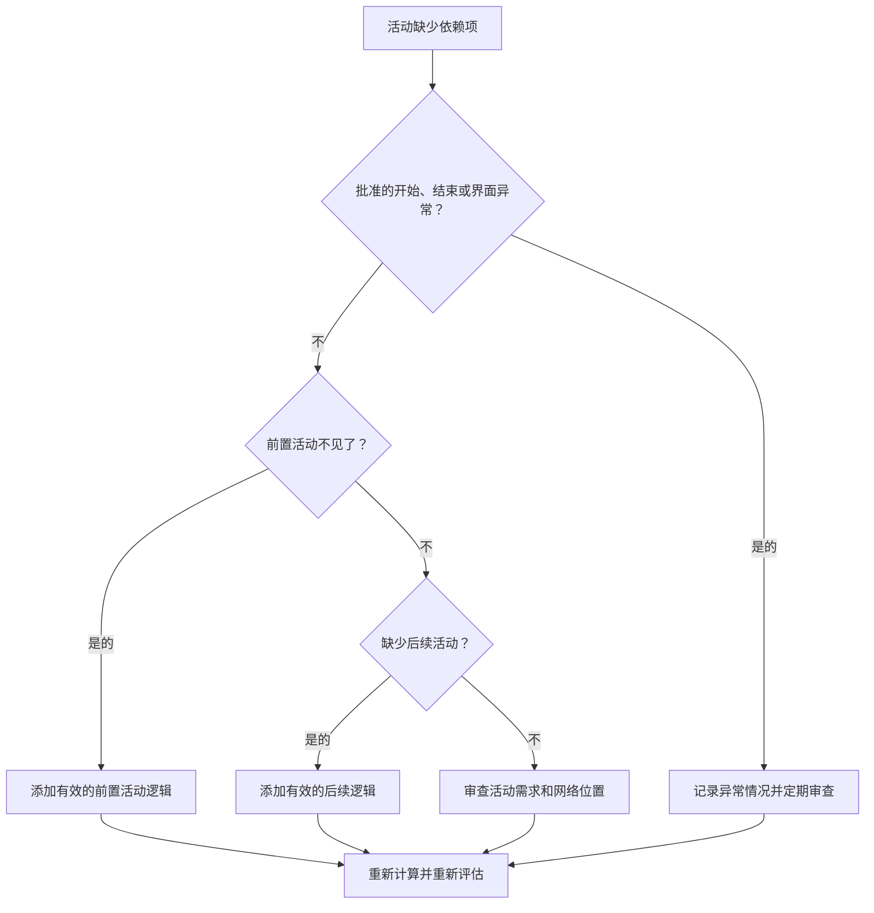

## 目的

本指南帮助进度计划人员识别并纠正 Primavera P6 中缺失的前置活动或后续逻辑。它通过提高 CPM 网络的完整性来支持进度质量。

## 开始之前

在采取行动之前收集以下信息：

- 该指标的当前评估结果。
- 没有先行者的活动列表。
- 没有后续活动的活动清单。
- 既没有前置活动逻辑也没有后续逻辑的活动列表。
- 活动 ID、活动名称、WBS、活动类型、活动状态、开始、完成、总浮时和日历。
- 批准的项目开始、项目结束、外部接口和合同例外清单。
- 最新更新说明和负责的专业或包所有者。

## 了解您的结果

一个强有力的结果是零未解决的活动且缺少依赖关系逻辑。

某些活动可能合法地没有先行者或后续活动，例如批准的项目开始里程碑、最终完成里程碑或批准的外部接口里程碑。这些应该受到限制并记录在案。

结果较差意味着计划中包含未正确连接到 CPM 网络的活动。

## 改进目标

目标是 0 个未解决且缺少依赖项的活动。

目标是将每个活动与有效的前导和后续逻辑连接起来，或记录其批准的异常原因。

## 行动计划

### 第 1 步：确定主要问题

创建一个 P6 布局或报告，用于过滤没有前置活动、没有后续或两者都没有的活动。包括活动 ID、活动名称、WBS、活动类型、活动状态、开始、完成、总浮时、日历、约束、前置任务和后续任务。

回顾每项活动并询问：

- 此活动是已批准的项目启动项还是项目完成项？
- 是外部接口、所有者控制的日期还是合同例外？
- 在这项活动开始之前必须完成哪些工作？
- 什么工作取决于该活动的完成或开始？
- 活动是否已过时、重复或状态不正确？
- 哪位业主可以确认真正的依赖关系？

### 第 2 步：应用建议的修复方法

对于开放开始，添加代表活动开始之前所需的实际条件的前置逻辑。这可能包括先前的工作、批准、访问、采购、设计发布、检查或移交。

对于开放式完成，添加表示取决于活动的后续逻辑。这可能包括后续工作、测试、调试、周转、收尾或完成里程碑。

对于没有前置活动和后续的孤立活动，确认该活动是否仍然需要。如果有效，请将其连接到网络。如果它已过时，请根据项目控制程序将其删除或关闭。

### 第 3 步：删除常见拦截器

常见的阻碍因素包括复制活动、不完整的片段、专业之间不明确的交接、缺少接口信息以及在已知排序之前加载活动的压力。

另一个阻碍是添加占位符关系只是为了传递指标。关系应该代表真正的依赖关系，而不是人为的联系。

### 第 4 步：验证更改

修正后重新计算进度计划。重新运行指标并确认每个剩余活动已连接或记录为已批准的例外。

检查总浮时、关键或最长路径、里程碑日期和近期前瞻报告，以确认添加的逻辑不会产生意外的变动。

## 改善计划

### 第一天：回顾和诊断

将度量和分组结果运行到缺失的前置活动、缺失的后续、孤立的活动、有效的例外和过时的活动中。

### 第 2-3 天：实施优先行动

首先纠正关键、近乎关键、合同和近期活动。在适当的情况下添加有效的逻辑并删除过时的活动。

### 第 4-5 天：监控早期结果

重新计算进度计划并审查浮时、关键路径、前瞻性日期和里程碑影响。

### 第六天：最终调整

与专业领导、包所有者、施工经理或项目控制领导一起解决剩余的依赖性问题。

### 第 7 天：重新评估和比较

再次运行评估并将结果与​​目标阈值进行比较。

## 追踪进度

使用简单的跟踪器来管理更正和批准。

| 日期 | 采取的行动 | 预期影响 | 结果/观察 | 下一步 |
| --- | --- | --- | --- | --- |
| [日期] | 检查缺少的依赖项 | 识别开放起点和开放终点 | [观察结果] | 指定所有者 |
| [日期] | 添加了前置逻辑 | 改进活动启动逻辑 | [观察结果] | 重新计算进度计划 |
| [日期] | 添加后续逻辑 | 提高活动完成的连续性 | [观察结果] | 重新评估指标 |

## 如果结果没有改善

如果结果没有改善，请检查是否添加了没有逻辑的新活动、导入的 Fragnet 是否不完整或异常规则是否过于宽松。

当未解决的项目影响关键路径、客户报告、付款里程碑、移交、采购或近期执行时，将其升级。

## 维护

在每个更新周期期间、计划导入之后和基线批准之前查看此指标。缺少的依赖项应该成为标准计划健康检查的一部分。

## 摘要清单

- [ ] 当前结果已审核
- [ ] 目标阈值已确定
- [ ] 开放开始审查
- [ ] 开放完成审查
- [ ] 审查孤立的活动
- [ ] 记录有效的异常情况
- [ ] 添加了缺少的前置活动逻辑
- [ ] 添加了缺少的后续逻辑
- [ ] 已解决过时的活动
- [ ] 进度计划重新计算
- [ ] 重复评估
- [ ] 记录后续步骤
## 相关内容
- [Primavera P6 中缺少依赖项](03_blog_template.md)
- [什么是进度计划](../../03b_blogs_zh/01_WHAT%20A%20SCHEDULE%20IS/01_blog.md)
- [强大的逻辑](../../03b_blogs_zh/02_ROBUST%20LOGIC/02_ROBUST%20LOGIC.md)
