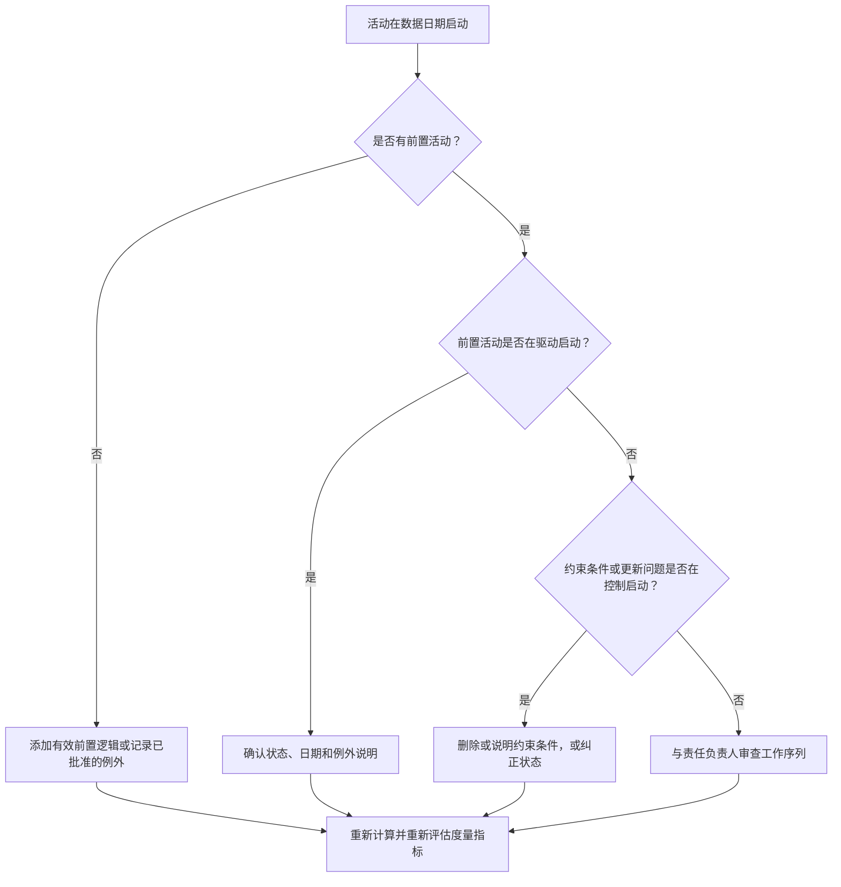

## 目的

本指南帮助进度计划师和项目控制团队减少或消除计划在 Primavera P6 数据日期启动但没有有效前置逻辑驱动的活动。适用于进度质量审查、PMO 健康检查和更新周期验证。

目标是确认近期工作由清晰的 CPM 逻辑支撑，且活动不是仅因关系缺失、约束条件、手动日期或进度更新不完整而在数据日期启动。

## 开始前准备

在采取行动之前，收集以下信息：

- 该度量指标的当前评估结果。
- 最新进度计算中使用的项目数据日期。
- 开始日期等于数据日期的开放或未启动活动清单。
- 每项活动的前置和后续关系详情。
- 约束条件、预期日期、实际日期和日历分配。
- 更新使用的 P6 进度选项，包括相关的逻辑保留或进度覆盖设置。
- 任何已批准的例外情况，例如项目开始活动、外部接口里程碑或业主指定的启动。

## 理解当前结果

强健的结果是：零个未解决的在数据日期启动且无驱动前置逻辑的活动。这意味着当前和近期工作已连接到进度网络，且数据日期不存在隐藏缺失排序的情况。

可接受的结果可能包括少量有记录的例外。这些应被审查和批准，而不是被忽视。例如，开工令里程碑或外部授权的活动可能不需要普通的前置活动，但原因应对审查人员可见。

薄弱的结果意味着多项活动在数据日期启动且没有清晰的逻辑驱动因素。这可能表明存在开放式开始、缺失的前置关系、过多约束条件、进度更新不完整，或最新更新后未被正确重排序的活动。

## 改善目标

目标是 0 个未解决的在数据日期启动且无有效驱动逻辑的活动。

改善目标不只是减少计数。更深层的目标是确保数据日期附近的每项活动都有可论证的预测启动原因。纠正后，每项受影响的活动要么应具有适当的前置逻辑，要么有记录在案的例外，要么有已纠正的状态／日期条件。

## 行动计划

### 步骤 1：识别主要问题

创建一个 P6 布局或报告，筛选开始日期等于数据日期的开放或未启动活动。包含以下列：活动 ID、活动名称、WBS、开始日期、完成日期、状态、总浮时、日历、主要约束条件、前置活动、后续活动，以及驱动关系指标（如可用）。

审查每项活动并提问：

- 该活动是否有任何前置活动？
- 如果前置活动存在，它们是否真正在驱动启动？
- 该活动是否被约束条件保留或移动？
- 该活动是否缺少实际开始日期或进度更新？
- 该活动是否是有效的例外，例如项目开始里程碑？
- 该活动是否属于逻辑普遍薄弱的 WBS 区域？

将发现结果归类为实际原因：缺失的前置活动、非驱动的前置活动、约束条件或预期日期、更新／状态错误，或已批准的例外情况。

### 步骤 2：应用建议的修复措施

首先处理缺失或薄弱的逻辑关系。添加代表真实工作序列的有效前置关系，例如完成到开始、开始到开始，或完成到完成（在适当情况下）。避免仅为满足度量指标而添加关系；每个关系应反映真实的施工、工程、采购、通道、审批或移交依赖关系。

接下来审查约束条件。如果活动因开始约束而在数据日期启动，确认该约束是否有合同或操作上的依据。删除不必要的约束，让活动由逻辑驱动。如果约束有效，记录原因，并确认其不会扭曲关键路径。

检查进度状态。如果工作已经开始，正确更新实际开始日期和剩余工期。如果工作尚未开始，确认预测启动日期是否应保持在数据日期。活动不应仅因更新周期将其拉到当前日期就显示为准备启动。

做出更改后，重新计算进度计划，再次审查受影响的活动。确认启动日期现在由逻辑驱动、状态正确，或已记录为已批准的例外。

### 步骤 3：消除常见阻碍因素

常见的阻碍因素包括现场反馈不清晰、接口信息缺失，以及让近期工作看起来准备就绪的压力。通过与专业负责人、施工经理、采购责任人或工作包经理审查受影响的活动来解决这些问题。

另一个常见的阻碍因素是将约束条件错误地用作逻辑的替代品。在某些情况下约束条件是必要的，但不应取代进度网络。如果约束条件被保留，记录其存在的原因以及它如何影响浮时和最长路径。

同时检查问题是否由进度计算设置或更新实践引起。如果进度覆盖（progress override）、逻辑保留（retained logic）、乱序进度或不完整的实绩化（actualization）影响了结果，在重新评估度量指标之前，将更新方法与项目控制程序对齐。

### 步骤 4：验证更改结果

在下次评估之前验证已纠正的进度计划。重新运行筛选器，查找在数据日期启动且无驱动逻辑的开放或未启动活动。确认每个剩余项目要么已纠正，要么已记录为已批准的例外。

重新计算后审查总浮时、最长路径和近期滚动计划活动。逻辑纠正可能改变关键路径或揭示额外的排序问题。如果进度变化较大，向项目控制负责人或 PMO 审查人员传达影响。

## 改善时间表

### 第 1 天：审查与诊断

运行度量指标，确认数据日期，并生成活动清单。将结果分类为：缺失逻辑、非驱动逻辑、约束条件、状态错误和潜在例外情况。

### 第 2-3 天：实施优先行动

首先纠正影响最大的活动，特别是关键或近关键活动。添加有效的前置逻辑，删除不必要的约束条件，更新不正确的状态，并记录例外情况。

### 第 4-5 天：监控早期结果

重新计算进度计划，审查受影响的活动是否现在由逻辑驱动。检查总浮时、最长路径和里程碑日期是否有意外变化。

### 第 6 天：最终调整

与责任专业或工作包负责人解决剩余阻碍因素。确认任何保留的例外情况均有依据且有清晰记录。

### 第 7 天：重新评估与对比

再次运行评估，将新结果与上次结果和目标阈值进行对比。确认度量指标现在是否为零个未解决的活动，或是否需要进一步行动。

## 跟踪进度

使用简单的追踪表管理纠正措施和审批情况。

| 日期 | 采取的行动 | 预期影响 | 结果／观察 | 下一步 |
| --- | --- | --- | --- | --- |
| [日期] | 审查在数据日期启动且无驱动逻辑的活动 | 识别缺失或薄弱的逻辑 | [观察到的结果] | 将纠正措施分配给责任负责人 |
| [日期] | 添加有效的前置关系 | 改善 CPM 排序 | [观察到的结果] | 重新计算并审查浮时影响 |
| [日期] | 删除或说明约束条件 | 减少人为启动 | [观察到的结果] | 确认剩余例外情况 |
| [日期] | 更新不正确的活动状态 | 提高更新准确性 | [观察到的结果] | 重新运行评估 |

## 如果结果没有改善

如果结果没有改善，检查是否同样的活动仍在不达标，或是否有新的活动出现在数据日期。反复不达标可能表明存在更广泛的进度开发问题，例如某个 WBS 区域的逻辑不完整、更新纪律薄弱，或约束条件使用不一致。

将持续性问题上报给项目控制负责人、计划经理或 PMO 审查人员。对于大型进度计划，考虑对受影响工作包举办专项逻辑审查研讨会。如果进度计划用于合同报告、延误分析或挣值预测，未解决的问题应被视为质量隐患。

## 维护

在每个更新周期发布进度计划之前审查该度量指标。该检查应作为标准进度健康审查的一部分，特别是在进度更新、重排序、重大范围变更或补救计划之后。

良好的维护习惯包括：在 P6 布局中保持前置和后续活动列可见，在每次提交之前审查开放式开始，记录已批准的例外情况，以及检查数据日期移动是否产生了新的未驱动活动群。

## 汇总检查清单

- [ ] 已审查当前结果
- [ ] 已确认目标阈值
- [ ] 已确认数据日期
- [ ] 已识别在数据日期启动的活动
- [ ] 已识别主要问题
- [ ] 已纠正缺失或薄弱的逻辑
- [ ] 已审查约束条件并说明理由或删除
- [ ] 已检查状态日期
- [ ] 已记录已批准的例外情况
- [ ] 已重新计算进度计划
- [ ] 已监控结果
- [ ] 已重复评估
- [ ] 已记录下一步行动
